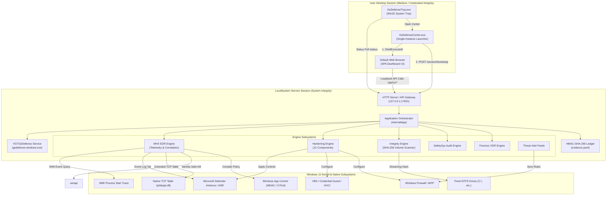
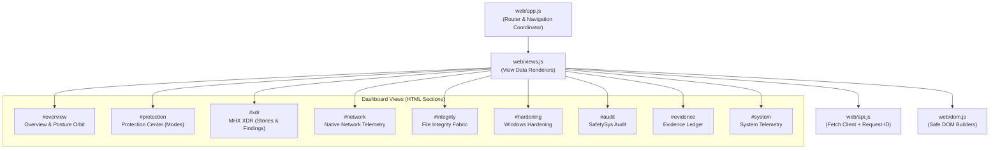
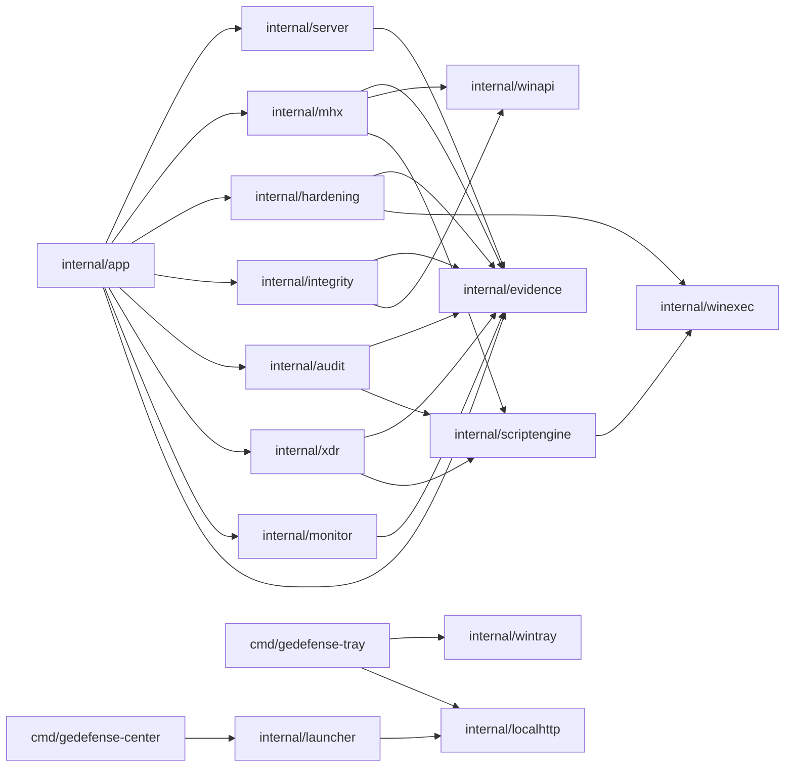
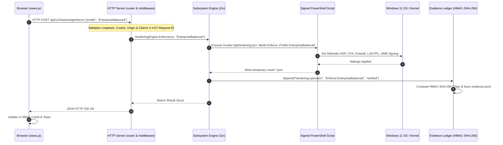

# Architecture: VGT GeDefense Windows 4

```text
// STATUS: DIAMANT VGT SUPREME
// PLATFORM: Windows 11 x64
// ARCHITECTURE MAP VERSION: 4.0.0-beta.1
// CONTROL PLANE: 127.0.0.1:17831
```

---

## Architecture Index

1. [System Overview & Architectural Principles](#1-system-overview--architectural-principles)
2. [Global Architectural Tree](#2-global-architectural-tree)
3. [Physical to Architectural File Mapping](#3-physical-to-architectural-file-mapping)
4. [Comprehensive Module Documentation](#4-comprehensive-module-documentation)
   - [4.1 Core Runtime & Service Host Module](#41-core-runtime--service-host-module)
   - [4.2 Dashboard & Local Web Control Plane](#42-dashboard--local-web-control-plane)
   - [4.3 Operator Center Launcher Module](#43-operator-center-launcher-module)
   - [4.4 System Tray Daemon Module](#44-system-tray-daemon-module)
   - [4.5 Standalone Installer & Release Packager Module](#45-standalone-installer--release-packager-module)
   - [4.6 MHX Realtime EDR & Correlation Subsystem](#46-mhx-realtime-edr--correlation-subsystem)
   - [4.7 Threat Intelligence & Firewall Orchestrator](#47-threat-intelligence--firewall-orchestrator)
   - [4.8 Sovereign Application Control & Allow Subsystem](#48-sovereign-application-control--allow-subsystem)
   - [4.9 Windows Baseline Hardening Subsystem](#49-windows-baseline-hardening-subsystem)
   - [4.10 Hardening Posture Drift Monitor](#410-hardening-posture-drift-monitor)
   - [4.11 SafetySys Compliance Audit Subsystem](#411-safetysys-compliance-audit-subsystem)
   - [4.12 Forensic XDR Deep-Scan Subsystem](#412-forensic-xdr-deep-scan-subsystem)
   - [4.13 File Integrity Fabric Subsystem](#413-file-integrity-fabric-subsystem)
   - [4.14 Tamper-Evident Evidence Ledger Subsystem](#414-tamper-evident-evidence-ledger-subsystem)
   - [4.15 Native Win32 Integration Subsystem](#415-native-win32-integration-subsystem)
   - [4.16 Token & Cryptographic Security Subsystem](#416-token--cryptographic-security-subsystem)
   - [4.17 Signed Script Execution Subsystem](#417-signed-script-execution-subsystem)
5. [Dashboard Detailed Documentation](#5-dashboard-detailed-documentation)
   - [5.1 View: Overview (`overview`)](#51-view-overview-overview)
   - [5.2 View: Protection Center (`protection`)](#52-view-protection-center-protection)
   - [5.3 View: MHX XDR (`xdr`)](#53-view-mhx-xdr-xdr)
   - [5.4 View: Native Network Telemetry (`network`)](#54-view-native-network-telemetry-network)
   - [5.5 View: File Integrity Fabric (`integrity`)](#55-view-file-integrity-fabric-integrity)
   - [5.6 View: Windows Hardening (`hardening`)](#56-view-windows-hardening-hardening)
   - [5.7 View: SafetySys Audit (`audit`)](#57-view-safetysys-audit-audit)
   - [5.8 View: Tamper-Evident Evidence (`evidence`)](#58-view-tamper-evident-evidence-evidence)
   - [5.9 View: System Telemetry (`system`)](#59-view-system-telemetry-system)
6. [CSS & UI Architecture](#6-css--ui-architecture)
7. [API Architecture & Endpoint Specification](#7-api-architecture--endpoint-specification)
8. [System-Wide Data Flows](#8-system-wide-data-flows)
9. [Core & Shared Dependencies](#9-core--shared-dependencies)
10. [Architectural Relations & Diagrams](#10-architectural-relations--diagrams)
11. [Precise File & Symbol References](#11-precise-file--symbol-references)
12. [Architectural Anomalies & Staged Components](#12-architectural-anomalies--staged-components)

---

## 1. System Overview & Architectural Principles

**VGT GeDefense Windows 4** is an on-premise, fully auditable Windows endpoint defense and security orchestration platform engineered by VisionGaia Technology. It coordinates built-in Windows 11 kernel-backed security mechanisms—including Microsoft Defender Antivirus, Windows Filtering Platform (WFP) / Windows Firewall, Attack Surface Reduction (ASR), Windows App Control (WDAC / CiTool), Virtualization-Based Security (VBS), and Hypervisor-Protected Code Integrity (HVCI)—into a single unified local control plane.

### Core Architectural Invariants

1. **Zero External Go Dependencies**: The backend leverages only the Go Standard Library and native Win32 DLL wrappers (`kernel32.dll`, `user32.dll`, `advapi32.dll`, `shell32.dll`, `iphlpapi.dll`). There are no third-party Go modules, no runtime CGO requirements, and `go.sum` is strictly zero bytes.
2. **Zero External Frontend Dependencies**: The dashboard contains no CDN links, external font providers, remote JavaScript packages, or external frameworks. All assets (HTML, CSS, JS, SVG/PNG) are compiled directly into the Go executable via `embed.FS`.
3. **Loopback-Only Control Plane**: The control plane binds strictly to `127.0.0.1:17831`. Requests are validated by RemoteAddr, Host header, Origin header, Bearer master token, or short-lived, authenticated HttpOnly/SameSite session cookies.
4. **Privilege Separation & Isolation**:
   - The UI runs inside the user's unprivileged default web browser.
   - The interactive tray (`GeDefenseTray.exe`) and center launcher (`GeDefenseCenter.exe`) run as the unprivileged desktop operator.
   - The core background service (`gedefense-windows.exe`) runs with `LocalSystem` privileges under the Windows Service Control Manager (SCM).
   - System state mutations are executed via cryptographically signed PowerShell transactions using `ExecutionPolicy AllSigned`.
5. **No Independent Kernel Sensor / Delegated Enforcement**: GeDefense avoids proprietary, unstable kernel filter drivers. Low-level enforcement is delegated to verified Windows OS layers: Defender, ASR, Windows Firewall, and Windows App Control.
6. **Defense-in-Depth Identity Validation**: Process termination is protected against PID-reuse race conditions: PID, creation timestamp, and binary path are strictly cross-checked before terminating any observed target. Network IOC hits do not possess autonomous host-kill authority.
7. **Tamper-Evident HMAC-SHA-256 Ledger**: Every configuration modification, security audit, EDR verdict, process block, and policy reconciliation is committed to a cryptographically chained, append-only JSONL ledger.

---

## 2. Global Architectural Tree

The following logical tree represents the actual software architecture of the GeDefense Windows 4 project:

```text
SYSTEM: VGT GeDefense Windows 4
│
├── USER-FACING CONTROL PLANE (Client Tier)
│   ├── Tray Daemon (GeDefenseTray.exe)
│   │   ├── Win32 Notification Area Shell (wintray)
│   │   ├── Local Status Poller (localhttp)
│   │   └── Process Launcher (GeDefenseCenter.exe)
│   │
│   ├── Center Launcher (GeDefenseCenter.exe)
│   │   ├── Single-Instance Named Mutex (Local\VGT.GeDefense.Center.v4)
│   │   ├── One-Time Bootstrap Exchange Client
│   │   └── Shell Browser Invocation (Default Windows Browser)
│   │
│   └── Web Security Center (Browser UI @ 127.0.0.1:17831)
│       ├── Layout & Shell (index.html, app.css, responsive.css)
│       ├── Design Token Subsystem (tokens.css)
│       ├── Reusable UI Components (components.css, dom.js)
│       ├── Local API Client & Auth Bridge (api.js)
│       └── Security Views (views.js, views.css)
│           ├── Overview (System Posture & Coverage)
│           ├── Protection Center (Monitor / Guarded / Sovereign Mode Management)
│           ├── MHX XDR 7.0 (Realtime Telemetry & Forensic Findings)
│           ├── Network Telemetry (Native TCP Flows & Owning PIDs)
│           ├── Integrity Fabric (Atomic SHA-256 Multi-Volume Scanner)
│           ├── Windows Hardening (12 Idempotent Controls & Rollback)
│           ├── SafetySys Audit (30+ Baseline Compliance Checks)
│           ├── Evidence Ledger (Chained HMAC-SHA-256 Inspection)
│           └── System (Host & Subsystem Runtime Status)
│
├── LOCAL CONTROL PLANE DAEMON (LocalSystem Service Tier)
│   ├── Service Host & SCM Dispatcher (gedefense-windows.exe)
│   │   ├── Windows Service Lifecycle Dispatcher (service)
│   │   ├── App Orchestrator & Worker Lifecycle Coordinator (app)
│   │   └── Version Metadata (product)
│   │
│   ├── HTTP Server & API Gateway (server)
│   │   ├── Static Asset Embedded Filesystem (web/ embed.FS)
│   │   ├── Security Middleware (Loopback, Headers, CSP, Rate-Limiter, Replay Guard)
│   │   ├── Session & One-Time Bootstrap Authenticator (session)
│   │   ├── Route Multiplexer (router)
│   │   └── Handlers (status, ops, mhx, evidence)
│   │
│   └── Background Long-Running Workers
│       ├── Posture Drift Monitor (5-minute periodic audit)
│       ├── MHX Telemetry & Correlation Pipeline (continuous process/network/defender streams)
│       └── File Integrity Scheduler (12h/24h periodic volume scans)
│
├── SECURITY SUBSYSTEMS & ENGINES (Domain Logic Tier)
│   ├── MHX Realtime EDR Engine (mhx)
│   │   ├── Process Start Telemetry Watcher (WMI Win32_ProcessStartTrace)
│   │   ├── Behavioral & LOLBin Evaluator (evaluator)
│   │   ├── Bounded PowerShell EncodedCommand Decoder (encoded_command)
│   │   ├── Defender Operational Event Tailer (EventLog 1116, 1117, 5001, etc.)
│   │   ├── Native TCP Extended Table Poller (iphlpapi.dll GetExtendedTcpTable)
│   │   ├── Multi-Signal Correlation & Attack Story Builder
│   │   └── PID-Reuse Protected Process Terminator (terminate_windows)
│   │
│   ├── Threat Intelligence Subsystem (mhx/feeds)
│   │   ├── Atomic Feed Synchronizer (abuse.ch Feodo, Spamhaus DROP)
│   │   ├── Bounded Radix/Prefix Address Index (prefixIndex)
│   │   └── Dynamic Windows Firewall Orchestrator (Sync-VgtMhxFirewall.ps1)
│   │
│   ├── Protection & Application Control Subsystem (xdr)
│   │   ├── Mode Orchestrator (Set-VgtMhxProtection.ps1)
│   │   ├── Sovereign Application Allow List (Set-VgtMhxApplicationAllow.ps1)
│   │   └── Windows App Control Policy Compiler & Deployer (Set-VgtMhxAppControl.ps1)
│   │
│   ├── Windows Baseline Hardening Engine (hardening)
│   │   ├── Idempotent Component Orchestrator (Invoke-VgtHardening.ps1)
│   │   ├── Domain Modules (Defender, Identity, Network, System, Common)
│   │   ├── Baseline Backup & Reversible Rollback Engine
│   │   └── Posture Status Cache
│   │
│   ├── SafetySys Compliance Audit Engine (audit)
│   │   ├── Audit Script Runner (Invoke-VgtSecurityAudit.ps1)
│   │   └── 30+ Deep Security Controls Scorer
│   │
│   ├── Forensic XDR Deep-Scan Subsystem (xdr)
│   │   ├── Persistence Scanner (Invoke-VgtXdrScan.ps1)
│   │   └── Forensic Entity & Memory Rule Engine
│   │
│   ├── File Integrity Fabric (integrity)
│   │   ├── Fixed Volume Discoverer (FixedDriveRoots)
│   │   ├── Reparse-Safe Streaming SHA-256 Hasher (256-bucket partitioned manifest)
│   │   ├── Mutation Detector & Differential Reporter (Changes)
│   │   └── Atomic State & Generation Store
│   │
│   └── Tamper-Evident Evidence Ledger (evidence)
│       ├── Append-Only Record File (evidence.jsonl)
│       ├── 256-Bit Secret Key Storage (evidence.key)
│       └── Cryptographic HMAC-SHA-256 Hash Chainer & Verifier
│
├── FOUNDATIONAL RUNTIME INFRASTRUCTURE (Core & Hardware Tier)
│   ├── Native Win32 API Layer (winapi)
│   │   ├── Process, Handles, Memory, Mutex, Events, Elevation (core_windows.go)
│   │   └── Extended TCP Telemetry Tables (network_windows.go)
│   │
│   ├── Process & PowerShell Execution Wrapper (winexec)
│   │   └── Validated Architecture-Native System32 PowerShell Resolver
│   │
│   ├── Cryptographic Security & Tokens (security)
│   │   ├── Master Dashboard Token Generator & Constant-Time Validator
│   │   └── ProgramData Local Vault ACL Manager
│   │
│   ├── Local HTTP Transport (localhttp)
│   │   └── Loopback-Optimized Transport with Strict Timeouts
│   │
│   └── Script Subsystem Host (scriptengine)
│       └── Output-Jailed, Signed JSON-Streaming Child Process Runner
│
└── PACKAGING, INSTALLATION & RELEASE PIPELINE
    ├── Standalone Setup Packager (cmd/gedefense-installer)
    ├── Installer Orchestrator (installer/Install-GeDefense.ps1)
    ├── Uninstaller Script (installer/Uninstall-GeDefense.ps1)
    ├── Self-Verifying Bootstrap (installer/Bootstrap-GeDefense.ps1)
    ├── Release Gates & Quality Verification (build/Test-GeDefenseRelease.ps1)
    ├── Payload Compilation & Catalog Signer (build/Build-VgtPayload.ps1)
    └── Full Standalone Builder (build/Build-GeDefenseStandalone.ps1)
```

---

## 3. Physical to Architectural File Mapping

The following mapping links each physical file relative to the project root to its respective architectural domain:

### Client Tier (Tray, Launcher, Web Dashboard)
- `src/GeDefense/windows/cmd/gedefense-center/main.go` → Single-instance GUI launcher; requests bootstrap code and opens browser.
- `src/GeDefense/windows/cmd/gedefense-tray/main.go` → System notification area background process; monitors status and triggers Center.
- `src/GeDefense/windows/internal/launcher/launcher_windows.go` → HTTP client for `/api/v1/session/bootstrap`; opens target URL via `ShellExecuteW`.
- `src/GeDefense/windows/internal/wintray/tray_windows.go` → Pure Win32 system tray implementation (window class, message loop, context menu).
- `src/GeDefense/windows/internal/localhttp/client.go` → Loopback HTTP client with customized timeout and transport configuration.
- `src/GeDefense/windows/internal/server/web/index.html` → Single-page application shell; semantic layout for all 9 views.
- `src/GeDefense/windows/internal/server/web/tokens.css` → Design tokens: dark theme palette, typography, glassmorphism, border radii.
- `src/GeDefense/windows/internal/server/web/app.css` → Core layout styles: ambient background, fixed sidebar, sticky topbar, typography.
- `src/GeDefense/windows/internal/server/web/components.css` → Reusable UI components: glass panels, status pills, tables, buttons, metrics, dialogs.
- `src/GeDefense/windows/internal/server/web/views.css` → View-specific styling: posture orbit, mode cards, attack story flows, grid layouts.
- `src/GeDefense/windows/internal/server/web/responsive.css` → Breakpoint rules for desktop, tablet (1180px), mobile (820px, 520px), and reduced-motion.
- `src/GeDefense/windows/internal/server/web/gedefense-logo.png` → Embedded brand logo asset for dashboard sidebar and favicon.
- `src/GeDefense/windows/internal/server/web/dom.js` → Pure DOM construction utilities strictly implementing textContent user-data sanitization.
- `src/GeDefense/windows/internal/server/web/api.js` → Browser API client; adds `X-VGT-Request-ID`, bearer headers, handles errors and cookie exchange.
- `src/GeDefense/windows/internal/server/web/views.js` → Data rendering engines for all 9 views; manages UI state and user interaction hooks.
- `src/GeDefense/windows/internal/server/web/app.js` → Application router, hashchange/navigation event coordinator, auto-refresh interval (6s), dialog handlers.

### Local Control Plane Daemon Tier
- `src/GeDefense/windows/cmd/gedefense-windows/main.go` → Service entrypoint; parses CLI flags (`--console`, `--launch`, `--version`) and invokes SCM.
- `src/GeDefense/windows/internal/service/service_windows.go` → Pure Win32 Service Control Manager integration (`StartServiceCtrlDispatcherW`).
- `src/GeDefense/windows/internal/app/app.go` → Main application composition root; instantiates engines, opens ledger, runs workers, starts HTTP server.
- `src/GeDefense/windows/internal/product/version.go` → Embedded version constant (`Version = "4.0.0-beta.1"`).
- `src/GeDefense/windows/internal/server/router.go` → HTTP ServeMux configuration; asset file serving and API route registration.
- `src/GeDefense/windows/internal/server/middleware.go` → Host, RemoteAddr, Origin, Rate-Limit, Replay Guard, and Security Header middleware.
- `src/GeDefense/windows/internal/server/session.go` → One-time bootstrap code generation, exchange logic, session cookie management.
- `src/GeDefense/windows/internal/server/response.go` → JSON response serialization, error wrapping, bounded request body reading.
- `src/GeDefense/windows/internal/server/types.go` → Server struct definition, subsystem interfaces (`HardeningEngine`, `MHXEngine`, etc.).
- `src/GeDefense/windows/internal/server/handlers_status.go` → Handlers for `/`, `/api/v1/status`, `/api/v1/protection/readiness`.
- `src/GeDefense/windows/internal/server/handlers_ops.go` → Handlers for hardening enforcement, rollback, components, audit, XDR scan, and integrity.
- `src/GeDefense/windows/internal/server/handlers_mhx.go` → Handlers for MHX status, analyses, network findings, attack stories, feeds, mode, application allows.
- `src/GeDefense/windows/internal/server/handlers_evidence.go` → Handlers for `/api/v1/evidence` snapshot and `/api/v1/evidence/verify`.

### EDR, XDR & Network Correlation (MHX)
- `src/GeDefense/windows/internal/mhx/model.go` → Domain models (`ProcessEvent`, `ProcessIdentity`, `Analysis`, `Status`, `NetworkFinding`, `AttackStory`, `Severity`, `Disposition`).
- `src/GeDefense/windows/internal/mhx/engine.go` → MHX orchestrator; coordinates telemetry channels, mode transitions, feed sync, network correlation.
- `src/GeDefense/windows/internal/mhx/evaluator.go` → Heuristic and behavioral analysis engine; inspects LOLBins, parentage, arguments, decoded commands.
- `src/GeDefense/windows/internal/mhx/encoded_command.go` → Bounded Base64 / UTF-16LE / ASCII decoder for PowerShell `-EncodedCommand`.
- `src/GeDefense/windows/internal/mhx/watcher_windows.go` → Host process watcher; spawns PowerShell WMI indication listener (`Win32_ProcessStartTrace`).
- `src/GeDefense/windows/internal/mhx/defender_watcher_windows.go` → Microsoft Defender event watcher; tails `Microsoft-Windows-Windows Defender/Operational`.
- `src/GeDefense/windows/internal/mhx/network_watcher_windows.go` → Native TCP table poller; periodically queries Win32 extended TCP table for remote connections.
- `src/GeDefense/windows/internal/mhx/terminate_windows.go` → PID-reuse protected process termination using `OpenProcess` and `TerminateProcess`.
- `src/GeDefense/windows/internal/mhx/dedupe.go` → Bounded, sliding-window deduplication cache for connection events.
- `src/GeDefense/windows/internal/mhx/feeds.go` → Threat intelligence manager; fetches external IP blocklists, builds in-memory radix index.
- `src/GeDefense/windows/internal/mhx/protection.go` → Controller interface and runner for PowerShell scripts managing Defender, Firewall, and App Control.
- `xdr/Invoke-VgtXdrScan.ps1` → Standalone forensic scanner; enumerates fileless execution, unsigned user-writable executables, persistence.
- `xdr/Set-VgtMhxProtection.ps1` → Script configuring Defender ASR rules, process creation auditing, and network default-deny policies.
- `xdr/Sync-VgtMhxFirewall.ps1` → Script staging threat intelligence IP indicators into partitioned Windows Firewall rule sets.
- `xdr/Set-VgtMhxApplicationAllow.ps1` → Script managing Authenticode-verified application exceptions for Sovereign mode.
- `xdr/Set-VgtMhxAppControl.ps1` → Script compiling and enforcing Windows Defender Application Control (WDAC) via `CiTool.exe`.
- `tools/Invoke-MhxAppControlDiagnostic.ps1` → Diagnostic tool for App Control policy generation and error logging.
- `tools/Test-MhxProcessTrace.ps1` → Diagnostic verification tool for WMI process start trace indications.
- `tools/Test-MhxWatcherIntegration.ps1` → Integration test executing an actual probe process to verify end-to-end watcher enrichment.

### Hardening, Audit & Posture Management
- `src/GeDefense/windows/internal/hardening/engine.go` → Go engine managing Windows hardening postures, profiles, and 12 modular components.
- `src/GeDefense/windows/internal/monitor/monitor.go` → 5-minute background monitor auditing Defender/firewall posture and logging state changes.
- `engine/Invoke-VgtHardening.ps1` → Master PowerShell hardening script executing `Audit`, `Enforce`, `Rollback`, or `Component`.
- `engine/Modules/Vgt.Common.psm1` → Shared PowerShell library for privilege verification, logging, registry writes, and baseline snapshots.
- `engine/Modules/Vgt.Defender.psm1` → Defender baseline configuration (PUA, MAPS, CloudBlock, CFA, ASR rules).
- `engine/Modules/Vgt.Identity.psm1` → Credential & Identity hardening (LSASS PPL, WDigest, UAC, VBS, Credential Guard).
- `engine/Modules/Vgt.Network.psm1` → Network baseline configuration (Firewall profiles, SMB signing, SMB1 disable, LLMNR, RDP).
- `engine/Modules/Vgt.System.psm1` → System & Execution hardening (Driver blocklist, Spectre/Meltdown overrides, ScriptBlock logging).
- `engine/profiles/enterprise-balanced.json` → Hardening profile definition for corporate balanced security without productivity disruption.
- `engine/profiles/isolation.json` → Hardening profile definition for maximum isolation (block-mode ASR, disabled USB, strict CFA).
- `src/GeDefense/windows/internal/audit/engine.go` → Go audit engine managing invocation of SafetySys compliance script.
- `audit/Invoke-VgtSecurityAudit.ps1` → PowerShell audit script measuring 30+ Windows security controls across Defender, Network, Platform, Identity.

### Integrity & Evidence Ledger
- `src/GeDefense/windows/internal/integrity/engine_windows.go` → Multi-threaded, reparse-safe SHA-256 file scanner with partitioned snapshot generations.
- `src/GeDefense/windows/internal/evidence/ledger.go` → HMAC-SHA-256 chained, append-only, tamper-evident audit ledger.

### Foundations & Native OS Interop
- `src/GeDefense/windows/internal/winapi/core_windows.go` → Low-level Win32 syscall wrappers (handles, processes, files, drives, mutexes, UI dialogs).
- `src/GeDefense/windows/internal/winapi/network_windows.go` → Native Win32 wrapper around `iphlpapi.dll!GetExtendedTcpTable`.
- `src/GeDefense/windows/internal/winexec/powershell.go` → Validated resolver for `%SystemRoot%\System32\WindowsPowerShell\v1.0\powershell.exe`.
- `src/GeDefense/windows/internal/security/token.go` → Secure master token generation, filesystem persistence (0600 ACL), constant-time comparison.
- `src/GeDefense/windows/internal/scriptengine/engine.go` → Generic runner executing signed PowerShell scripts with temporary JSON output jailing.

### Installer, Packaging & Release Pipeline
- `src/GeDefense/windows/cmd/gedefense-installer/main.go` → Standalone setup bootstrapper; unpacks embedded archive, validates signatures, runs installer.
- `src/GeDefense/windows/cmd/gedefense-installer/bundle_development.go` → Stub payload provider for non-bundled development builds (`!vgt_bundle`).
- `src/GeDefense/windows/cmd/gedefense-installer/bundle_release.go` → Embedded payload zip provider for production release builds (`vgt_bundle`).
- `installer/Bootstrap-GeDefense.ps1` → First-stage installer script; validates certificates and catalog, elevates to administrator.
- `installer/Install-GeDefense.ps1` → Main installation script; deploys binaries, sets up ProgramData ACLs, registers service, creates shortcuts.
- `installer/Uninstall-GeDefense.ps1` → Clean uninstallation script; stops/removes service, deletes binaries, retains evidence ledger.
- `build/Test-GeDefenseRelease.ps1` → Master verification gate; tests formatting, vet, race, zero-dependencies, forbidden imports, security headers.
- `build/Build-VgtPayload.ps1` → Compiles binaries, signs scripts/executables, creates catalog `vgt-payload.cat`, populates `payload/`.
- `build/Build-GeDefenseStandalone.ps1` → Packages payload into embedded zip, compiles standalone installer, signs final setup executable.
- `build/Build-SourceRelease.ps1` → Generates canonical source distribution archive and SHA-256 manifest.

---

## 4. Comprehensive Module Documentation

### 4.1 Core Runtime & Service Host Module

#### Purpose
Executes as the central Windows Service (`VGTGeDefense`) under the `LocalSystem` security context. Manages the lifecycle of all internal engines, background workers, and the authenticated HTTP control plane.

#### Capabilities
- Integrates directly with the Windows Service Control Manager without external libraries via `StartServiceCtrlDispatcherW`.
- Provides an interactive console mode (`--console`) for debugging and integration testing.
- Instantiates and binds shared infrastructure: the HMAC-SHA-256 evidence ledger, master token, script engines, and background workers.
- Implements graceful shutdown: closes the HTTP listener, signals background workers via channels, and waits up to 12 seconds before forceful termination.

#### Associated Files
- **Backend Entrypoint**: `src/GeDefense/windows/cmd/gedefense-windows/main.go`
- **Application Orchestrator**: `src/GeDefense/windows/internal/app/app.go`
- **Service Integration**: `src/GeDefense/windows/internal/service/service_windows.go`
- **Product Metadata**: `src/GeDefense/windows/internal/product/version.go`
- **Dependencies**: Uses `internal/evidence`, `internal/security`, `internal/server`, `internal/hardening`, `internal/mhx`, `internal/integrity`, `internal/audit`, `internal/xdr`, `internal/monitor`, `internal/winapi`.
- **Used by**: Windows Service Control Manager (`services.exe`), Operator command line.

---

### 4.2 Dashboard & Local Web Control Plane

#### Purpose
Provides an embedded, zero-dependency, authenticated web server listening strictly on `127.0.0.1:17831` to deliver the administrative UI and secure REST APIs to the local operator.

#### Capabilities
- Enforces strict security boundaries: remote address validation (loopback only), host header validation, origin cross-checking, and non-bypassable rate-limiting (300 requests/minute per client).
- Prevents replay attacks via required `X-VGT-Request-ID` UUID headers on all mutating requests (POST, PUT, DELETE).
- Emits hardened HTTP headers: strict Content-Security-Policy (no inline scripts, no eval, no external connections), COOP `same-origin`, CORP `same-origin`, `X-Frame-Options: DENY`, `X-Content-Type-Options: nosniff`.
- Generates single-use, 60-second bootstrap tokens exchanged for 8-hour HttpOnly/SameSite session cookies.
- Serves embedded single-page application assets compiled into the binary via `embed.FS`.

#### Associated Files
- **Backend Router & Handlers**: `src/GeDefense/windows/internal/server/router.go`, `handlers_status.go`, `handlers_ops.go`, `handlers_mhx.go`, `handlers_evidence.go`, `middleware.go`, `session.go`, `response.go`, `types.go`
- **Frontend SPA**: `src/GeDefense/windows/internal/server/web/index.html`, `app.js`, `views.js`, `api.js`, `dom.js`
- **Styles**: `src/GeDefense/windows/internal/server/web/tokens.css`, `app.css`, `components.css`, `views.css`, `responsive.css`
- **Unit Tests**: `src/GeDefense/windows/internal/server/server_test.go`
- **Dependencies**: Uses `internal/evidence`, `internal/security`, and domain engine interfaces.
- **Used by**: `GeDefenseCenter.exe`, user web browser.

---

### 4.3 Operator Center Launcher Module

#### Purpose
Acts as the user-facing entrypoint (`GeDefenseCenter.exe`) executed by the operator. Ensures single-instance execution, securely retrieves a one-time bootstrap token from the service, and opens the default web browser to the authenticated security center.

#### Capabilities
- Prevents concurrent instances using a Win32 named mutex (`Local\VGT.GeDefense.Center.v4`).
- Reads the protected master token from `%ProgramData%\VGT\GeDefense\dashboard.token`.
- Initiates an authorized POST request to `/api/v1/session/bootstrap` to acquire an ephemeral bootstrap code.
- Invokes the default browser via `ShellExecuteW` pointing to `http://127.0.0.1:17831/#bootstrap=<code>`.
- Displays native Win32 message boxes if the service is unreachable or errors occur.

#### Associated Files
- **Entrypoint**: `src/GeDefense/windows/cmd/gedefense-center/main.go`
- **Launcher Engine**: `src/GeDefense/windows/internal/launcher/launcher_windows.go`
- **HTTP Client**: `src/GeDefense/windows/internal/localhttp/client.go`
- **Dependencies**: Uses `internal/winapi`, `internal/localhttp`, `internal/product`.
- **Used by**: Desktop shortcuts, Start Menu, System Tray daemon.

---

### 4.4 System Tray Daemon Module

#### Purpose
Runs in the operator's user session as a lightweight tray notification icon (`GeDefenseTray.exe`). Continuously polls the local service to reflect health status visually and provides quick actions to open the Security Center.

#### Capabilities
- Ensures a single tray instance per user session using a named mutex (`Local\VGT.GeDefense.Tray.Instance.v4`) and named event (`Local\VGT.GeDefense.Tray.Open.v4`).
- Implements a pure Win32 notification icon using `Shell_NotifyIconW` and a dedicated window message loop.
- Periodically queries `/api/v1/status` using the local master token to verify Defender, MHX, and Firewall health.
- Displays dynamic tooltip status: "Sovereign aktiv", "Guarded aktiv", "Nur Überwachung", or "Prüfung erforderlich".
- Provides a context menu with actions to launch `GeDefenseCenter.exe` or exit the tray.

#### Associated Files
- **Entrypoint**: `src/GeDefense/windows/cmd/gedefense-tray/main.go`
- **Tray Framework**: `src/GeDefense/windows/internal/wintray/tray_windows.go`
- **Dependencies**: Uses `internal/winapi`, `internal/localhttp`, `internal/product`.
- **Used by**: Windows Startup (`HKLM\...\Run`), User shell.

---

### 4.5 Standalone Installer & Release Packager Module

#### Purpose
Provides a self-contained, digitally signed Windows installation and uninstallation package (`GeDefense-Setup-x64-v4.0.0-beta.1.exe`).

#### Capabilities
- Extracts embedded zip payloads (`payload.zip`) safely: guards against zip-slip attacks, symlink traversal, decompression bombs, and reserved device names.
- Validates Microsoft Authenticode signatures against the official VGT release certificate thumbprint.
- Elevates installation execution via `Bootstrap-GeDefense.ps1` with `Verb RunAs`.
- Sets up NTFS Discretionary Access Control Lists (DACLs) on `%ProgramData%\VGT\GeDefense` granting exclusive control to Administrators and `NT AUTHORITY\SYSTEM`.
- Registers the service using native `sc.exe create` with auto-start configuration.

#### Associated Files
- **Installer Binary**: `src/GeDefense/windows/cmd/gedefense-installer/main.go`, `bundle_release.go`, `bundle_development.go`
- **PowerShell Scripts**: `installer/Bootstrap-GeDefense.ps1`, `installer/Install-GeDefense.ps1`, `installer/Uninstall-GeDefense.ps1`
- **Build Scripts**: `build/Build-GeDefenseStandalone.ps1`, `build/Build-VgtPayload.ps1`, `build/Test-GeDefenseRelease.ps1`
- **Tests**: `src/GeDefense/windows/cmd/gedefense-installer/main_test.go`, `bundle_release_test.go`
- **Dependencies**: Uses `internal/winapi`, `internal/winexec`, `internal/product`.

---

### 4.6 MHX Realtime EDR & Correlation Subsystem

#### Purpose
The core detection and response engine. Collects real-time telemetry from process launches, Microsoft Defender operational logs, and native network connections, identifies threats through heuristic evaluation, and orchestrates identity-safe remediation.

#### Capabilities
- **WMI Process Telemetry**: Spawns an internal PowerShell pipeline registering for `Win32_ProcessStartTrace` events; monitors 21 key Living-off-the-Land Binaries (LOLBins).
- **PowerShell EncodedCommand Decoding**: Parses `-e`, `-enc`, `-encodedcommand` arguments; decodes UTF-16LE / Base64 payloads; extracts SHA-256 digests and length metrics without storing raw command lines in logs.
- **Defender Operational Event Tailer**: Tails `Microsoft-Windows-Windows Defender/Operational` for malware detections (1116), remediations (1117), and tamper events (5001, 5010, 5012).
- **Attack Story Correlation**: Connects process execution context, LOLBin behavior signals, and Threat Intelligence network destinations into structured Attack Stories.
- **Identity-Safe Process Termination**: In `Guarded` or `Sovereign` modes, terminates malicious processes only after revalidating that PID, process creation time (within 2s tolerance), and executable image path match the original observation.

#### Associated Files
- **Core Engine**: `src/GeDefense/windows/internal/mhx/engine.go`, `model.go`
- **Detection & Evaluation**: `src/GeDefense/windows/internal/mhx/evaluator.go`, `encoded_command.go`
- **Watchers**: `src/GeDefense/windows/internal/mhx/watcher_windows.go`, `defender_watcher_windows.go`, `network_watcher_windows.go`
- **Remediation**: `src/GeDefense/windows/internal/mhx/terminate_windows.go`, `dedupe.go`
- **Tests**: `evaluator_test.go`, `dedupe_test.go`, `mode_transition_test.go`, `watcher_script_windows_test.go`, `runtime_probe_integration_test.go`
- **Dependencies**: Uses `internal/evidence`, `internal/winapi`, `internal/winexec`.
- **Used by**: `internal/app`, `internal/server`.

---

### 4.7 Threat Intelligence & Firewall Orchestrator

#### Purpose
Maintains a local threat intelligence repository of malicious IP ranges and synchronizes them directly into native Windows Firewall block rules.

#### Capabilities
- Downloads threat feeds every 12 hours from `abuse.ch Feodo Tracker` and `Spamhaus DROP` (IPv4 and IPv6).
- Validates CIDRs and excludes private/local/reserved ranges (e.g. `127.0.0.0/8`, `10.0.0.0/8`, `192.168.0.0/16`) to prevent self-lockout.
- Compiles prefixes into an in-memory radix lookup map for sub-millisecond connection checks.
- Writes an atomic snapshot to `%ProgramData%\VGT\GeDefense\mhx\intelligence\threat-intelligence.json`.
- Invokes `xdr/Sync-VgtMhxFirewall.ps1` to partition and stage firewall block rules in chunks of 200 into rule group `VGT GeDefense Threat Intelligence <guid>`.

#### Associated Files
- **Feed Manager**: `src/GeDefense/windows/internal/mhx/feeds.go`
- **Firewall Script**: `xdr/Sync-VgtMhxFirewall.ps1`
- **Tests**: `src/GeDefense/windows/internal/mhx/feeds_test.go`
- **Dependencies**: Uses `internal/winapi`, `internal/scriptengine`.
- **Used by**: `internal/mhx/engine.go`.

---

### 4.8 Sovereign Application Control & Allow Subsystem

#### Purpose
Implements the highest security tier (`Sovereign`), enforcing Windows Defender Application Control (WDAC) and managing authenticated application network exceptions.

#### Capabilities
- Compiles WDAC XML policies merging default Windows audit baselines, VGT installation root rules, and operator-approved applications into binary `.cip` files.
- Applies policies to the kernel via `CiTool.exe --update-policy`.
- Manages an allow list of executables in `%ProgramData%\VGT\GeDefense\mhx\application-allows.json`.
- Requires applications to possess a valid Authenticode signature and matching SHA-256 digest before granting outbound network communication in Sovereign mode.
- Creates explicit outbound permit rules in Windows Firewall rule group `VGT GeDefense Sovereign Allows`.

#### Associated Files
- **Controller Bridge**: `src/GeDefense/windows/internal/mhx/protection.go`
- **App Control Script**: `xdr/Set-VgtMhxAppControl.ps1`
- **Application Allow Script**: `xdr/Set-VgtMhxApplicationAllow.ps1`
- **Dependencies**: Uses `internal/scriptengine`, `internal/winapi`.
- **Used by**: `internal/mhx/engine.go`, `internal/server/handlers_mhx.go`.

---

### 4.9 Windows Baseline Hardening Subsystem

#### Purpose
Evaluates, enforces, and rolls back 12 critical Windows 11 platform security controls through audited, idempotent configuration transactions.

#### Capabilities
- Provides pre-configured profiles: `EnterpriseBalanced` and `Isolation`.
- Controls 12 individual security mechanisms: Defender Cloud & Network Protection, ASR Rules, Controlled Folder Access, Windows Firewall, Credential Guard, Memory Integrity (HVCI), LSASS PPL, SMB Hardening, PowerShell ScriptBlock Logging, UAC Secure Desktop, USB Storage Blocking, and Remote Desktop Disabling.
- Saves an initial system baseline snapshot before any modification to support lossless rollbacks.
- Caches posture results for 30 seconds to minimize WMI/registry query overhead.

#### Associated Files
- **Go Engine**: `src/GeDefense/windows/internal/hardening/engine.go`
- **PowerShell Harness**: `engine/Invoke-VgtHardening.ps1`
- **PowerShell Modules**: `engine/Modules/Vgt.Common.psm1`, `Vgt.Defender.psm1`, `Vgt.Identity.psm1`, `Vgt.Network.psm1`, `Vgt.System.psm1`
- **Profiles**: `engine/profiles/enterprise-balanced.json`, `engine/profiles/isolation.json`
- **Tests**: `src/GeDefense/windows/internal/hardening/components_test.go`
- **Dependencies**: Uses `internal/evidence`, `internal/winexec`.
- **Used by**: `internal/app`, `internal/server`, `internal/monitor`.

---

### 4.10 Hardening Posture Drift Monitor

#### Purpose
A background service running every 5 minutes to audit system posture, detect administrative drift or tampering, and commit discrepancies to the evidence ledger.

#### Capabilities
- Periodically invokes `hardening.Engine.Audit()`.
- Calculates a posture fingerprint string summarizing core controls: Defender, Antivirus service, Realtime, Behavior, Cloud, Network, Firewall, Windows Update, ASR rules, and Signature age.
- Detects security degradation (e.g. Defender disabled, signatures older than 3 days) and records an immutable log entry.

#### Associated Files
- **Source**: `src/GeDefense/windows/internal/monitor/monitor.go`
- **Tests**: `src/GeDefense/windows/internal/monitor/monitor_test.go`
- **Dependencies**: Uses `internal/hardening`, `internal/evidence`.
- **Used by**: `internal/app/app.go`.

---

### 4.11 SafetySys Compliance Audit Subsystem

#### Purpose
Executes a read-only, non-disruptive security baseline audit measuring 30+ enterprise security controls across Windows Defender, Network, Platform, Identity, and System telemetry.

#### Capabilities
- Evaluates controls against predefined expected configurations (e.g. Secure Boot, BitLocker, TPM 2.0, VBS, SMBv1, WinRM authentication, LSA protection, UAC prompt behavior).
- Computes an overall compliance percentage score and categorizes checks by severity (Critical, High, Medium, Low, Info) and status (Pass, Fail, Warning, NotApplicable).
- Emits results to an operation-jailed temporary JSON file and records the audit run in the evidence ledger.

#### Associated Files
- **Go Engine**: `src/GeDefense/windows/internal/audit/engine.go`
- **PowerShell Script**: `audit/Invoke-VgtSecurityAudit.ps1`
- **Dependencies**: Uses `internal/evidence`, `internal/scriptengine`.
- **Used by**: `internal/app`, `internal/server`.

---

### 4.12 Forensic XDR Deep-Scan Subsystem

#### Purpose
Executes deep on-demand forensic inspections of the host to uncover advanced in-memory execution, suspicious user-writable binaries, and persistence mechanisms.

#### Capabilities
- Discovers live process command lines matching obfuscated execution or in-memory loader patterns (`DownloadString`, `FromBase64String`, `Reflection.Assembly`).
- Identifies unsigned executables running from user-writable paths (`AppData`, `Temp`, `Downloads`) maintaining active outbound TCP connections.
- Inspects Windows persistence mechanisms: Registry Run keys (HKLM, WOW6432Node, HKU), Scheduled Tasks, and Windows Services with user-writable paths.
- Records structured findings with SHA-256 IDs, severity, category, entity, and evidence metadata.

#### Associated Files
- **Go Engine**: `src/GeDefense/windows/internal/xdr/engine.go`
- **PowerShell Script**: `xdr/Invoke-VgtXdrScan.ps1`
- **Dependencies**: Uses `internal/evidence`, `internal/scriptengine`.
- **Used by**: `internal/app`, `internal/server`.

---

### 4.13 File Integrity Fabric Subsystem

#### Purpose
Provides an atomic, high-performance, disk-wide file integrity scanning engine that monitors regular files on fixed drives for unauthorized modifications.

#### Capabilities
- Enumerates all fixed drives using native Win32 `GetLogicalDrives` and `GetDriveTypeW`.
- Reparse-safe file traversal: excludes junctions, symlinks, and directory reparse points via handle-based metadata verification (`GetFileInformationByHandle`).
- Computes SHA-256 hashes using a bounded worker pool (`runtime.NumCPU() * 2`) and 64 KiB read buffers.
- Re-verifies file size and modification timestamps after hashing to detect race-condition modifications during the scan.
- Partitions hashes into 256 bucketed JSONL files indexed by the leading byte of the path's SHA-256 hash.
- Compares against previous baseline generations to produce differential records (`Added`, `Modified`, `Deleted`).
- Atomic generation activation: replaces state only upon 100% completion of all partitions.

#### Associated Files
- **Go Engine**: `src/GeDefense/windows/internal/integrity/engine_windows.go`
- **Tests**: `src/GeDefense/windows/internal/integrity/engine_windows_test.go`
- **Dependencies**: Uses `internal/evidence`, `internal/winapi`.
- **Used by**: `internal/app`, `internal/server`.

---

### 4.14 Tamper-Evident Evidence Ledger Subsystem

#### Purpose
Provides an append-only, cryptographically chained audit log recording every system state change, security decision, and administrative action.

#### Capabilities
- Maintains a 256-bit secret key in `%ProgramData%\VGT\GeDefense\evidence.key` (ACL restricted to 0600).
- Stores events in `%ProgramData%\VGT\GeDefense\evidence.jsonl`.
- Each record contains: `Sequence`, `Timestamp`, `Kind`, `Action`, `Result`, `PreviousMAC`, and `MAC`.
- Computes an HMAC-SHA-256 MAC over the canonical JSON representation of each record, binding it to the previous record's MAC.
- Verifies the entire cryptographic chain on service startup and via user demand (`/api/v1/evidence/verify`).

#### Associated Files
- **Go Engine**: `src/GeDefense/windows/internal/evidence/ledger.go`
- **Tests**: `src/GeDefense/windows/internal/evidence/ledger_test.go`
- **Dependencies**: Uses standard library `crypto/hmac`, `crypto/sha256`.
- **Used by**: Almost all subsystems (`app`, `server`, `mhx`, `hardening`, `audit`, `xdr`, `integrity`, `monitor`).

---

### 4.15 Native Win32 Integration Subsystem

#### Purpose
Replaces external CGO and Go packages with direct, memory-safe, lazy-loaded Windows DLL system call wrappers.

#### Capabilities
- **Handles & Synchronization**: `CloseHandle`, `CreateMutexW`, `CreateEventW`, `SetEvent`, `WaitForSingleObject`.
- **Process Management**: `OpenProcess`, `TerminateProcess`, `GetProcessTimes`, `QueryFullProcessImageNameW`, `OpenProcessToken`, `GetTokenInformation`.
- **Filesystem & Drives**: `MoveFileExW` (atomic replace), `GetLogicalDrives`, `GetDriveTypeW`, `CreateFileW`, `GetFileInformationByHandle`.
- **Network Telemetry**: Calls `iphlpapi.dll!GetExtendedTcpTable` for IPv4 (`AF_INET`) and IPv6 (`AF_INET6`), parsing connection states and mapping to Owning PIDs.
- **Shell & UI**: `ShellExecuteW` for default browser launching; `MessageBoxW` for native error reporting.

#### Associated Files
- **Core Wrappers**: `src/GeDefense/windows/internal/winapi/core_windows.go`
- **Network Telemetry**: `src/GeDefense/windows/internal/winapi/network_windows.go`
- **Dependencies**: Standard library `syscall`, `unsafe`, `net/netip`.
- **Used by**: `service`, `wintray`, `launcher`, `mhx`, `integrity`, `cmd/*`.

---

### 4.16 Token & Cryptographic Security Subsystem

#### Purpose
Manages administrative authentication tokens and ensures cryptographic isolation on the local machine.

#### Capabilities
- Generates 32-byte cryptographically secure random tokens encoded in base64 URL format.
- Stores the master token in `%ProgramData%\VGT\GeDefense\dashboard.token`.
- Restricts filesystem access using Windows API file creation flags (`O_CREATE|O_EXCL|O_WRONLY`, 0600).
- Performs constant-time token comparisons (`subtle.ConstantTimeCompare`) to prevent timing side-channel attacks.

#### Associated Files
- **Source**: `src/GeDefense/windows/internal/security/token.go`
- **Tests**: `src/GeDefense/windows/internal/security/token_test.go`
- **Dependencies**: Standard library `crypto/rand`, `crypto/subtle`.
- **Used by**: `internal/app`, `internal/server/middleware.go`.

---

### 4.17 Signed Script Execution Subsystem

#### Purpose
A secure execution bridge for invoking signed PowerShell transactions with structured JSON streaming.

#### Capabilities
- Resolves the verified system PowerShell binary via `%SystemRoot%\System32\WindowsPowerShell\v1.0\powershell.exe`.
- Executes scripts with strict parameters: `-NoLogo -NoProfile -NonInteractive -ExecutionPolicy AllSigned`.
- Enforces an operation jail: ensures all temporary JSON output files reside within `%ProgramData%\VGT\GeDefense\operations\`.
- Binds operations to context timeouts and captures limited standard error streams (up to 64 KiB) while discarding raw standard output.
- Parses UTF-8 JSON results (stripping byte order marks) into strongly-typed Go structures.

#### Associated Files
- **Runner**: `src/GeDefense/windows/internal/scriptengine/engine.go`
- **PowerShell Path Resolver**: `src/GeDefense/windows/internal/winexec/powershell.go`
- **Tests**: `src/GeDefense/windows/internal/winexec/powershell_test.go`
- **Dependencies**: Standard library `os/exec`, `encoding/json`.
- **Used by**: `audit`, `xdr`, `mhx/protection`.

---

## 5. Dashboard Detailed Documentation

The Security Center SPA presents 9 dedicated operational views accessed via URL fragments (`/#<page>`).

```text
DASHBOARD VIEW MAP:
├── #overview   → Overview & Defense Coverage
├── #protection → Protection Center (Monitor / Guarded / Sovereign)
├── #xdr        → MHX XDR 7.0 (Analyses & Forensic Findings)
├── #network    → Native Network Telemetry
├── #integrity  → File Integrity Fabric
├── #hardening  → Windows Hardening & Rollback
├── #audit      → SafetySys Compliance Audit
├── #evidence   → Tamper-Evident Ledger
└── #system     → Local Host Runtime Telemetry
```

---

### 5.1 View: Overview (`overview`)

- **Route**: `/#overview` (Default view)
- **Frontend Files**: `index.html` (lines 49-65), `views.js` (`loadOverview`, `renderStatus`, `renderStories`), `app.js`
- **CSS / Styling**: `app.css`, `views.css` (`.hero`, `.posture-orbit`, `.two-col`, `.bars`, `.compact-stats`), `components.css`
- **Used UI Components**: Glass cards, posture score ring, domain coverage bars, metric cards, status pills, attack stories list.
- **Responsible Modules**: `internal/server`, `internal/hardening`, `internal/mhx`.
- **API Calls Made**:
  1. `GET /api/v1/status`
  2. `GET /api/v1/mhx/stories?limit=6`
- **Backend Handlers**: `s.status` (`handlers_status.go`), `s.mhxStories` (`handlers_mhx.go`).
- **Services Involved**: `HardeningEngine.Posture()`, `MHXEngine.Status()`, `IntegrityEngine.Status()`, `MHXEngine.AttackStories()`.
- **Data Displayed**:
  - Global posture score (0-100%) computed from 15 core security controls.
  - Defense Coverage bars across Endpoint, Network, Platform, and Response domains.
  - Live EDR metrics: processes evaluated, identity-safe responses, threat IP hits, attack story count.
  - Realtime telemetry status (`ONLINE` vs `DEGRADED`) and policy health.
  - Recent attack stories.
- **User Actions**: Click "Schutzstatus öffnen" (navigates to `#protection`), click "Alle anzeigen" (navigates to `#xdr`).
- **Data Flow**:

```text
Browser User opens /#overview
      ↓
views.js: loadOverview()
      ↓
Parallel API Requests:
  ├─ GET /api/v1/status (Cookie / Bearer)
  └─ GET /api/v1/mhx/stories?limit=6
      ↓
server/middleware.go: headers() + authorize() checks
      ↓
server/handlers_status.go: s.status()
  ├─ hardening.Engine.Posture()
  ├─ mhx.Engine.Status()
  └─ integrity.Engine.Status()
server/handlers_mhx.go: s.mhxStories()
  └─ mhx.Engine.AttackStories(6)
      ↓
JSON Response
      ↓
views.js: renderStatus() + renderStories()
      ↓
DOM Construction (dom.js: textContent / createElement)
```

---

### 5.2 View: Protection Center (`protection`)

- **Route**: `/#protection`
- **Frontend Files**: `index.html` (lines 67-76), `views.js` (`loadProtection`, `readiness`, `setProtectionMode`), `app.js`
- **CSS / Styling**: `views.css` (`.protection-state`, `.protection-visual`, `.mode-grid`, `.mode-card`, `.readiness`, `.readiness-row`)
- **Used UI Components**: Protection level cards (Monitor, Guarded, Sovereign), transition modal dialog (`#protectionDialog`), readiness checklist.
- **Responsible Modules**: `internal/mhx`, `xdr/Set-VgtMhxProtection.ps1`, `xdr/Set-VgtMhxAppControl.ps1`.
- **API Calls Made**:
  1. `GET /api/v1/status`
  2. `GET /api/v1/protection/readiness?target={monitor|guarded|sovereign}`
  3. `POST /api/v1/mhx/mode` (Body: `{mode, confirmation, reason}`)
- **Backend Handlers**: `s.protectionReadiness` (`handlers_status.go`), `s.mhxSetMode` (`handlers_mhx.go`).
- **Services Involved**: `MHXEngine.SetMode()`, `MHXEngine.Status()`, `evidence.Ledger.Append()`, PowerShell orchestrators.
- **Data Displayed**:
  - Current protection level (`MONITOR`, `GUARDED`, `SOVEREIGN`).
  - Protection policy verification status (`VERIFIED` with UTC timestamp).
  - Readiness check results: blockers and security consequences.
- **User Actions**:
  - Select protection level (triggers readiness evaluation).
  - Confirm transition with operator reason in dialog (requires specific typed confirmation phrases).
- **Data Flow**:

```text
User selects "Guarded" or "Sovereign"
      ↓
views.js: readiness(target) → GET /api/v1/protection/readiness?target=...
      ↓
server/handlers_status.go: modeReady() checks realtime telemetry & policy verification
      ↓
UI displays readiness checklist & opens #protectionDialog
      ↓
User enters justification & confirms
      ↓
views.js: setProtectionMode() → POST /api/v1/mhx/mode (with X-VGT-Request-ID)
      ↓
server/handlers_mhx.go: mhxSetMode()
  ├─ Replay claim validation
  ├─ Preflight ledger append: "protection.request"
  ├─ mhx.Engine.SetMode(ctx, mode)
  │    ├─ Policy lock acquisition (policyGate)
  │    ├─ Ledger integrity check
  │    ├─ Apply verified mode via Set-VgtMhxProtection.ps1 / Set-VgtMhxAppControl.ps1
  │    ├─ Rollback on verification failure
  │    └─ Persist mode to %ProgramData%\VGT\GeDefense\mhx\mode.json
  └─ Ledger append: "mhx.mode"
      ↓
JSON Status Response → UI updates state & displays success toast
```

---

### 5.3 View: MHX XDR (`xdr`)

- **Route**: `/#xdr`
- **Frontend Files**: `index.html` (lines 78-84), `views.js` (`loadXdr`, `runXdr`, `syncFeeds`), `app.js`
- **CSS / Styling**: `views.css` (`.story-list`, `.story`, `.story-flow`), `components.css` (`table`, `severity`, `status-pill`)
- **Used UI Components**: Attack story timeline cards, Realtime analysis table, Forensic scan findings table, action buttons.
- **Responsible Modules**: `internal/mhx`, `internal/xdr`, `xdr/Invoke-VgtXdrScan.ps1`.
- **API Calls Made**:
  1. `GET /api/v1/mhx/status`
  2. `GET /api/v1/mhx/analyses?limit=100`
  3. `GET /api/v1/mhx/stories?limit=100`
  4. `GET /api/v1/xdr/findings`
  5. `POST /api/v1/mhx/feeds/sync` (On click "Threat Intelligence synchronisieren")
  6. `POST /api/v1/xdr/scan` (On click "Tiefenscan starten")
- **Backend Handlers**: `s.mhxStatus`, `s.mhxAnalyses`, `s.mhxStories`, `s.mhxSyncFeeds` (`handlers_mhx.go`), `s.xdrFindings`, `s.runXDR` (`handlers_ops.go`).
- **Services Involved**: `MHXEngine.Analyses()`, `MHXEngine.AttackStories()`, `MHXEngine.SyncFeeds()`, `XDREngine.Scan()`, `XDREngine.Last()`.
- **Data Displayed**:
  - Live process analyses (Time, Severity, Image, PID, Detection, Signals, Disposition).
  - Correlated attack stories (Process → Remote Network Target, signal chain, response eligibility).
  - Forensic deep scan findings (Severity, Category, Finding Title, Entity, Evidence digest).
- **User Actions**: Synchronize threat feeds manually, launch on-demand forensic deep scan.

---

### 5.4 View: Native Network Telemetry (`network`)

- **Route**: `/#network`
- **Frontend Files**: `index.html` (lines 86-90), `views.js` (`loadNetwork`), `app.js`
- **CSS / Styling**: `components.css`, `views.css`
- **Used UI Components**: Metric grid, Threat Network Findings table.
- **Responsible Modules**: `internal/mhx/network_watcher_windows.go`, `internal/winapi/network_windows.go`, `internal/mhx/feeds.go`.
- **API Calls Made**:
  1. `GET /api/v1/mhx/status`
  2. `GET /api/v1/mhx/network?limit=250`
- **Backend Handlers**: `s.mhxStatus`, `s.mhxNetwork` (`handlers_mhx.go`).
- **Services Involved**: `MHXEngine.NetworkFindings()`, `winapi.TCPConnections()`.
- **Data Displayed**:
  - Observed TCP connections count, threat IP hit count, active threat indicators.
  - Table of correlated threat network connections (Timestamp, Process Image, PID, Remote IP, Remote Port, Severity, Response verdict).
- **User Actions**: Read-only monitoring; auto-refreshed every 6 seconds.

---

### 5.5 View: File Integrity Fabric (`integrity`)

- **Route**: `/#integrity`
- **Frontend Files**: `index.html` (lines 92-97), `views.js` (`loadIntegrity`, `toggleIntegrity`, `scanIntegrity`), `app.js`
- **CSS / Styling**: `components.css` (`.progress`), `views.css`
- **Used UI Components**: Scan progress bar, scan configuration controls (schedule select, toggle button, scan now), changes table.
- **Responsible Modules**: `internal/integrity`.
- **API Calls Made**:
  1. `GET /api/v1/integrity/status`
  2. `GET /api/v1/integrity/changes?limit=500`
  3. `POST /api/v1/integrity/configuration` (Body: `{enabled, intervalHours}`)
  4. `POST /api/v1/integrity/scan`
- **Backend Handlers**: `s.integrityStatus`, `s.integrityChanges`, `s.integrityConfiguration`, `s.integrityScan` (`handlers_ops.go`).
- **Services Involved**: `IntegrityEngine.Status()`, `IntegrityEngine.Changes()`, `IntegrityEngine.Configure()`, `IntegrityEngine.Start()`.
- **Data Displayed**:
  - Total files hashed, data hashed (bytes formatted), modification count, read error count.
  - Current scan status (`DISABLED`, `SCHEDULED`, `RUNNING`, `READY`), generation hash, next scheduled run.
  - Table of detected changes: Type (Added, Modified, Deleted), File Path, Old SHA-256, New SHA-256, Size.
- **User Actions**: Configure automated interval (12h / 24h), toggle monitoring on/off, trigger immediate scan.

---

### 5.6 View: Windows Hardening (`hardening`)

- **Route**: `/#hardening`
- **Frontend Files**: `index.html` (lines 99-104), `views.js` (`loadHardening`, `enforceComponent`, `enforceBalanced`, `rollback`), `app.js`
- **CSS / Styling**: `views.css` (`.component-grid`, `.component-card`, `.rollback-card`), `components.css`
- **Used UI Components**: 12 modular component cards with category pills and activation buttons, rollback card, confirmation modal dialog.
- **Responsible Modules**: `internal/hardening`, `engine/Invoke-VgtHardening.ps1`.
- **API Calls Made**:
  1. `GET /api/v1/hardening/components`
  2. `POST /api/v1/hardening/components` (Body: `{id}`)
  3. `POST /api/v1/hardening/enforce` (Body: `{profile: "EnterpriseBalanced"}`)
  4. `POST /api/v1/hardening/rollback`
- **Backend Handlers**: `s.hardeningComponents`, `s.enforceHardeningComponent`, `s.enforce`, `s.rollback` (`handlers_ops.go`).
- **Services Involved**: `HardeningEngine.Components()`, `HardeningEngine.EnforceComponent()`, `HardeningEngine.Enforce()`, `HardeningEngine.Rollback()`.
- **Data Displayed**: Status of 12 controls (Active/Missing, Reboot requirement, technical description).
- **User Actions**:
  - Enforce individual security components.
  - Apply the recommended `EnterpriseBalanced` profile.
  - Perform a complete rollback to the initial saved system baseline.

---

### 5.7 View: SafetySys Audit (`audit`)

- **Route**: `/#audit`
- **Frontend Files**: `index.html` (lines 106-109), `views.js` (`loadAudit`), `app.js`
- **CSS / Styling**: `components.css` (`table`, `severity`, `metric-card`)
- **Used UI Components**: Compliance metric grid (Score %, Passed, Failed, Warnings), Checks table, "Audit starten" action button.
- **Responsible Modules**: `internal/audit`, `audit/Invoke-VgtSecurityAudit.ps1`.
- **API Calls Made**: `POST /api/v1/audit/run`
- **Backend Handlers**: `s.runAudit` (`handlers_ops.go`).
- **Services Involved**: `AuditEngine.Run()`, `Invoke-VgtSecurityAudit.ps1`.
- **Data Displayed**: Compliance score (%), passed/failed counts, check table (Check ID, Category, Title, Status, Actual vs. Expected values).
- **User Actions**: Trigger on-demand baseline compliance audit.

---

### 5.8 View: Tamper-Evident Evidence (`evidence`)

- **Route**: `/#evidence`
- **Frontend Files**: `index.html` (lines 111-114), `views.js` (`loadEvidence`, `verifyEvidence`), `app.js`
- **CSS / Styling**: `components.css` (`table`)
- **Used UI Components**: Evidence table, "Ledger verifizieren" action button.
- **Responsible Modules**: `internal/evidence`.
- **API Calls Made**:
  1. `GET /api/v1/evidence`
  2. `POST /api/v1/evidence/verify`
- **Backend Handlers**: `s.evidenceSnapshot`, `s.verifyEvidence` (`handlers_evidence.go`).
- **Services Involved**: `evidence.Ledger.Snapshot()`, `evidence.Ledger.Verify()`.
- **Data Displayed**: Sequence number, UTC timestamp, event kind, action, result.
- **User Actions**: Verify entire cryptographic HMAC-SHA-256 chain integrity on demand.

---

### 5.9 View: System Telemetry (`system`)

- **Route**: `/#system`
- **Frontend Files**: `index.html` (lines 116-119), `views.js` (`loadOverview`), `app.js`
- **CSS / Styling**: `views.css` (`.system-grid`, `.system-card`)
- **Used UI Components**: System property cards.
- **Responsible Modules**: `internal/server`, `internal/product`, `internal/mhx`.
- **API Calls Made**: `GET /api/v1/status`
- **Backend Handlers**: `s.status` (`handlers_status.go`).
- **Data Displayed**: Version string, Windows platform build, Control Plane binding address, Process telemetry status, Network telemetry mode, App Control status, Protection policy health.
- **User Actions**: Read-only status inspection.

---

## 6. CSS & UI Architecture

The UI architecture follows a pure CSS token-driven system with dark-mode first principles, high contrast, and zero external runtime or CSS preprocessors.

```text
CSS ARCHITECTURE:
tokens.css       → Global Design Variables (--bg, --panel, --blue, --cyan, --radius, --sans, --mono)
  ↓
app.css          → Ambient background glow, CSS Grid shell, fixed sidebar, sticky topbar
  ↓
components.css   → Reusable atomic UI elements (buttons, glass panels, tables, pills, dialogs, toasts)
  ↓
views.css        → View layout rules (hero orbit, mode cards, attack story flows, readiness checklist)
  ↓
responsive.css   → Responsive breakpoints (1180px, 820px, 520px) and accessibility prefers-reduced-motion
```

### Style File Breakdown & Component Association

| CSS File | Scope | Key Selectors & Design Rules | Components & Pages Influenced |
|---|---|---|---|
| `tokens.css` | Global Tokens | `:root`: `--bg: #050b14`, `--panel: rgba(9,24,43,.68)`, `--blue: #4cc9ff`, `--green: #31d0aa`, `--red: #ff5c7c`, `--cyan: #64efff`, `--mono`, `--sans` | All components, fonts, borders, colors across all views |
| `app.css` | Layout & Shell | `body`, `.ambient`, `.shell`, `.sidebar`, `.brand`, `.nav`, `.nav.active`, `.sidebar-foot`, `.topbar`, `.title-stack`, `.view` | Navigation sidebar, brand header, window frame, top status bar, active view animations |
| `components.css` | Atomic Controls | `.glass`, `.button` (`.primary`, `.danger`, `.ghost`, `.small`), `.status-pill` (`.good`, `.warn`, `.bad`, `.info`), `.metric-grid`, `.metric-card`, `table`, `th`, `td`, `.severity`, `.progress`, `.toast`, `dialog` | All metric cards, data tables, severity tags, action buttons, modals (`#authDialog`, `#protectionDialog`, `#confirmDialog`), toasts |
| `views.css` | Page-Specific | `.hero`, `.posture-orbit`, `.two-col`, `.bars`, `.compact-stats`, `.protection-state`, `.mode-grid`, `.mode-card`, `.readiness`, `.story-list`, `.story`, `.component-grid`, `.component-card`, `.rollback-card`, `.system-grid` | Overview hero orbit, Protection Center mode selection cards, XDR story chains, Hardening component grid, System properties |
| `responsive.css` | Adaptability | `@media(max-width: 1180px)`: 2-column grids<br>`@media(max-width: 820px)`: slide-out mobile drawer, stacked headers<br>`@media(max-width: 520px)`: single-column metrics<br>`@media(prefers-reduced-motion)`: disable rotations | Responsive reflow on smaller displays, mobile hamburger menu, accessibility compliance |

---

## 7. API Architecture & Endpoint Specification

All endpoints are hosted exclusively on `127.0.0.1:17831`. Mutating requests require an `X-VGT-Request-ID` header.

| Endpoint | Method | Frontend Caller | Handler Function | Responsible Subsystem | Storage / Data Source | Auth Level |
|---|---|---|---|---|---|---|
| `/` | GET | Browser Navigation | `s.index` | `internal/server` | Embedded `web/index.html` | Public (Loopback) |
| `/assets/*` | GET | Browser Asset Loader | FileServer | `internal/server` | Embedded `web/*` assets | Public (Loopback) |
| `/api/v1/session/bootstrap` | POST | `launcher.BootstrapURL` | `s.bootstrap` | `internal/server` | In-memory `bootstrapCodes` | Master Token |
| `/api/v1/session/exchange` | POST | `api.js: exchangeBootstrap` | `s.exchange` | `internal/server` | In-memory `sessions` & cookie | Valid Bootstrap Code |
| `/api/v1/status` | GET | `views.js: loadOverview`, `loadProtection`, `app.js` | `s.status` | `hardening`, `mhx`, `integrity` | WMI, Registry, Engine Statuses | Session / Master |
| `/api/v1/protection/readiness` | GET | `views.js: readiness` | `s.protectionReadiness` | `internal/mhx` | MHX Engine Status | Session / Master |
| `/api/v1/mhx/status` | GET | `views.js: loadXdr`, `loadNetwork` | `s.mhxStatus` | `internal/mhx` | In-memory MHX status struct | Session / Master |
| `/api/v1/mhx/analyses` | GET | `views.js: loadXdr` | `s.mhxAnalyses` | `internal/mhx` | In-memory `analyses` ring buffer | Session / Master |
| `/api/v1/mhx/network` | GET | `views.js: loadNetwork` | `s.mhxNetwork` | `internal/mhx` | In-memory `networkFindings` ring | Session / Master |
| `/api/v1/mhx/stories` | GET | `views.js: loadOverview`, `loadXdr` | `s.mhxStories` | `internal/mhx` | In-memory `attackStories` ring | Session / Master |
| `/api/v1/mhx/feeds/sync` | POST | `views.js: syncFeeds` | `s.mhxSyncFeeds` | `mhx/feeds`, `Sync-VgtMhxFirewall` | External Feeds & Windows Firewall | Session / Master + Request-ID |
| `/api/v1/mhx/mode` | POST | `views.js: setProtectionMode` | `s.mhxSetMode` | `internal/mhx`, `xdr` scripts | `mode.json`, WFP, Defender | Session / Master + Request-ID |
| `/api/v1/mhx/applications` | GET | Engine / Diagnostics | `s.mhxApplications` | `xdr/Set-VgtMhxApplicationAllow` | `application-allows.json` | Session / Master |
| `/api/v1/mhx/applications` | POST | Operator / Scripts | `s.mhxSetApplication` | `xdr/Set-VgtMhxApplicationAllow` | `application-allows.json`, Firewall | Session / Master + Request-ID |
| `/api/v1/hardening/components` | GET | `views.js: loadHardening` | `s.hardeningComponents` | `internal/hardening` | WMI & Registry via Audit | Session / Master |
| `/api/v1/hardening/components` | POST | `views.js: enforceComponent` | `s.enforceHardeningComponent`| `engine/Invoke-VgtHardening` | Registry, Defender, WFP | Session / Master + Request-ID |
| `/api/v1/hardening/enforce` | POST | `views.js: enforceBalanced` | `s.enforce` | `engine/Invoke-VgtHardening` | System Settings & Registry | Session / Master + Request-ID |
| `/api/v1/hardening/rollback` | POST | `views.js: rollback` | `s.rollback` | `engine/Invoke-VgtHardening` | `baseline.json` | Session / Master + Request-ID |
| `/api/v1/audit/run` | POST | `views.js: loadAudit` | `s.runAudit` | `audit/Invoke-VgtSecurityAudit` | Windows OS Security State | Session / Master + Request-ID |
| `/api/v1/xdr/findings` | GET | `views.js: loadXdr` | `s.xdrFindings` | `internal/xdr` | Last Forensic Scan Cache | Session / Master |
| `/api/v1/xdr/scan` | POST | `views.js: runXdr` | `s.runXDR` | `xdr/Invoke-VgtXdrScan.ps1` | Live Host Processes & Storage | Session / Master + Request-ID |
| `/api/v1/integrity/status` | GET | `views.js: loadIntegrity` | `s.integrityStatus` | `internal/integrity` | `state.json` | Session / Master |
| `/api/v1/integrity/changes` | GET | `views.js: loadIntegrity` | `s.integrityChanges` | `internal/integrity` | Snapshot change database | Session / Master |
| `/api/v1/integrity/configuration` | POST | `views.js: toggleIntegrity` | `s.integrityConfiguration` | `internal/integrity` | `state.json` | Session / Master + Request-ID |
| `/api/v1/integrity/scan` | POST | `views.js: scanIntegrity` | `s.integrityScan` | `internal/integrity` | Local Volumes (C:\, etc.) | Session / Master + Request-ID |
| `/api/v1/evidence` | GET | `views.js: loadEvidence` | `s.evidenceSnapshot` | `internal/evidence` | `evidence.jsonl` | Session / Master |
| `/api/v1/evidence/verify` | POST | `views.js: verifyEvidence` | `s.verifyEvidence` | `internal/evidence` | `evidence.jsonl` & `evidence.key` | Session / Master + Request-ID |

---

## 8. System-Wide Data Flows

### 8.1 Local Session Bootstrap & Token Exchange Flow

```text
Operator launches GeDefenseCenter.exe
        ↓
GeDefenseCenter: claims named mutex "Local\VGT.GeDefense.Center.v4"
        ↓
launcher.BootstrapURL(): reads %ProgramData%\VGT\GeDefense\dashboard.token
        ↓
POST http://127.0.0.1:17831/api/v1/session/bootstrap
  Headers: [Authorization: Bearer <master-token>, X-VGT-Request-ID: <uuid>]
        ↓
server/middleware.go: masterAuthorize() validates token in constant-time
        ↓
server/session.go: s.bootstrap() generates 43-char cryptographically random code
        ↓
Returns JSON: {"code": "<bootstrap-code>"}
        ↓
GeDefenseCenter invokes default browser via ShellExecuteW:
  http://127.0.0.1:17831/#bootstrap=<bootstrap-code>
        ↓
Browser loads embedded index.html & app.js
        ↓
app.js extracts bootstrap code from URL fragment & clears hash
        ↓
POST http://127.0.0.1:17831/api/v1/session/exchange
  Body: {"code": "<bootstrap-code>"}
        ↓
server/session.go: s.exchange() consumes code (single-use), issues session cookie
        ↓
Sets HTTP Cookie: VGTSESSION=<session-token>; Path=/; Max-Age=28800; HttpOnly; SameSite=Strict
        ↓
Subsequent dashboard requests are authenticated seamlessly via session cookie.
```

---

### 8.2 Real-time Process Event Trace, Enrichment & Guarded Termination

```text
Process launched on Windows (e.g. powershell.exe -enc ...)
        ↓
WMI provider fires Win32_ProcessStartTrace indication
        ↓
mhx/watcher_windows.go: processTraceScript captures event
        ↓
PowerShell helper enriches process:
  ├─ Authenticode signature check (Get-AuthenticodeSignature)
  ├─ Parent process identification
  ├─ Ancestry chain walk (up to 6 levels)
  └─ SHA-256 binary hash computation
        ↓
Streams NDJSON to stdout → Read by Go mhx/watcher_windows.go scanner
        ↓
mhx.Engine receives ProcessEvent via internal Go channel
        ↓
mhx.Evaluator.Analyze(event):
  ├─ Identifies LOLBin tokens (IEX, DownloadString, AmsiScanBuffer, etc.)
  ├─ Bounded decoding of Base64 / UTF-16LE EncodedCommand (encoded_command.go)
  ├─ Derives signal categories (lolbin, evasion, credential, etc.)
  └─ Determines Disposition: ALLOW, AUDIT, or BLOCK
        ↓
Record stored in bounded ring buffer (analyses)
        ↓
Is Disposition == BLOCK and ProtectionMode in ("guarded", "sovereign")?
        ├── YES: mhx/terminate_windows.go: terminateProcess()
        │          ├─ OpenProcessIdentity(PID)
        │          ├─ Verify CreationTime matches original observation (within 2s)
        │          ├─ Verify ImagePath matches original observation
        │          ├─ TerminateProcess(handle, 0xC0000420)
        │          └─ Ledger.Append("mhx.block", detection, "terminated")
        └── NO:  Record retained for audit and correlation
```

---

### 8.3 Threat Intelligence Synchronization & Dynamic Firewall Enforcement

```text
Timer triggers (every 12h) or Operator clicks "Threat Intelligence synchronisieren"
        ↓
POST /api/v1/mhx/feeds/sync (with X-VGT-Request-ID)
        ↓
server/handlers_mhx.go: s.mhxSyncFeeds()
        ↓
mhx.FeedManager.Sync():
  ├─ Fetch from abuse.ch Feodo Tracker & Spamhaus DROP IPv4/IPv6 over TLS 1.2+
  ├─ Filter non-public, reserved, and loopback CIDRs (prevent self-lockout)
  ├─ Build in-memory prefix radix index for sub-millisecond lookup
  └─ Write atomic JSON snapshot: %ProgramData%\VGT\GeDefense\mhx\intelligence\threat-intelligence.json
        ↓
mhx.protectionManager.ApplyThreatIntelligence():
  ├─ Executes xdr/Sync-VgtMhxFirewall.ps1 with ExecutionPolicy AllSigned
  ├─ Script verifies administrative credentials
  ├─ Script generates staging rule group: "VGT GeDefense Threat Intelligence <guid>"
  ├─ Stages rules in chunks of 200 CIDRs (New-NetFirewallRule -Direction Inbound/Outbound -Action Block)
  ├─ Removes previous generation rule groups atomically
  └─ Returns generation metadata JSON
        ↓
Ledger.Append("mhx.intelligence", "12h-sync", "verified")
        ↓
UI renders updated indicator count and sync timestamp.
```

---

### 8.4 Native TCP Network Telemetry & Attack Story Correlation

```text
mhx/network_watcher_windows.go: ticker fires every 2 seconds
        ↓
winapi.TCPConnections():
  Calls iphlpapi.dll!GetExtendedTcpTable for IPv4 and IPv6
        ↓
Iterates rows, filters for State == Established and PID > 4
        ↓
Deduplicates via sliding window (seen.Admit, 5-minute TTL)
        ↓
Dispatches networkEvent{PID, LocalPort, RemoteIP, RemotePort} over Go channel
        ↓
mhx.Engine.evaluateNetwork():
  ├─ Checks if RemoteIP matches in-memory FeedManager prefix radix index
  │    └─ NO: Ignore
  │    └─ YES: Threat Intelligence Hit!
  ├─ Generates NetworkFinding record
  ├─ Inspects recentProcesses[PID]
  │    ├─ Is observed process still valid? (PID + CreationTime revalidated)
  │    └─ YES: Formulate AttackStory!
  │         ├─ Story connects: Process Image + Analysis Signals + Remote IP + Port
  │         ├─ If Analysis had ResponseAuthority: Mark story as HOST_RESPONSE_ELIGIBLE
  │         └─ Append to attackStories ring buffer
  ├─ Ledger.Append("mhx.network", remoteIP, "threat-intelligence-match")
  └─ If mode != "monitor" and process has independent BLOCK verdict:
       terminateProcess() executed with PID-reuse validation.
```

---

## 9. Core & Shared Dependencies

The following files are foundational system components marked explicitly as `CORE / SHARED DEPENDENCY`. Modifying any of these components impacts multiple subsystems.

```text
CORE DEPENDENCY HIERARCHY:
winapi (core_windows.go, network_windows.go)
  ├── used by service, wintray, launcher, mhx, integrity, cmd/*
evidence (ledger.go)
  ├── used by app, server, mhx, hardening, audit, xdr, integrity, monitor
winexec & scriptengine
  ├── used by hardening, audit, xdr, mhx, installer
security (token.go)
  ├── used by app, server, launcher, tray
web (api.js, dom.js, tokens.css)
  ├── used by all 9 dashboard views
```

### 1. `src/GeDefense/windows/internal/evidence/ledger.go`
- **Classification**: `CORE / SHARED DEPENDENCY`
- **Role**: Provides the append-only, HMAC-SHA-256 chained cryptographic ledger (`Ledger`).
- **Dependent Modules**:
  - `internal/app/app.go` (opens ledger during boot)
  - `internal/server/handlers_evidence.go` (snapshot & verify endpoints)
  - `internal/server/handlers_mhx.go` (records mode changes)
  - `internal/hardening/engine.go` (records hardening actions)
  - `internal/audit/engine.go` (records audit executions)
  - `internal/xdr/engine.go` (records forensic scans)
  - `internal/mhx/engine.go` (records telemetry, EDR blocks, feeds)
  - `internal/integrity/engine_windows.go` (records scan completions)
  - `internal/monitor/monitor.go` (records drift events)

### 2. `src/GeDefense/windows/internal/winapi/core_windows.go`
- **Classification**: `CORE / SHARED DEPENDENCY`
- **Role**: Foundational Win32 system call layer (handles, processes, tokens, files, UI).
- **Dependent Modules**:
  - `internal/service/service_windows.go`
  - `internal/wintray/tray_windows.go`
  - `internal/launcher/launcher_windows.go`
  - `internal/mhx/terminate_windows.go`
  - `internal/integrity/engine_windows.go`
  - `cmd/gedefense-center/main.go`
  - `cmd/gedefense-tray/main.go`
  - `cmd/gedefense-installer/main.go`

### 3. `src/GeDefense/windows/internal/winapi/network_windows.go`
- **Classification**: `CORE / SHARED DEPENDENCY`
- **Role**: Native Windows TCP table enumeration mapping active connections to PIDs.
- **Dependent Modules**:
  - `internal/mhx/network_watcher_windows.go`

### 4. `src/GeDefense/windows/internal/winexec/powershell.go`
- **Classification**: `CORE / SHARED DEPENDENCY`
- **Role**: Path and security validator for `%SystemRoot%\System32\WindowsPowerShell\v1.0\powershell.exe`.
- **Dependent Modules**:
  - `internal/scriptengine/engine.go`
  - `internal/hardening/engine.go`
  - `cmd/gedefense-installer/main.go`

### 5. `src/GeDefense/windows/internal/scriptengine/engine.go`
- **Classification**: `CORE / SHARED DEPENDENCY`
- **Role**: Out-of-process signed PowerShell transaction runner with JSON result capture.
- **Dependent Modules**:
  - `internal/audit/engine.go`
  - `internal/xdr/engine.go`
  - `internal/mhx/protection.go`

### 6. `src/GeDefense/windows/internal/security/token.go`
- **Classification**: `CORE / SHARED DEPENDENCY`
- **Role**: Secret token generator and constant-time string comparator.
- **Dependent Modules**:
  - `internal/app/app.go`
  - `internal/server/middleware.go`

### 7. `src/GeDefense/windows/internal/localhttp/client.go`
- **Classification**: `CORE / SHARED DEPENDENCY`
- **Role**: Standardized HTTP client for loopback service communication with strict timeouts.
- **Dependent Modules**:
  - `internal/launcher/launcher_windows.go`
  - `cmd/gedefense-tray/main.go`

### 8. `src/GeDefense/windows/internal/server/web/api.js`
- **Classification**: `CORE / SHARED DEPENDENCY`
- **Role**: Client-side HTTP abstraction, request signing (`X-VGT-Request-ID`), error normalization.
- **Dependent Modules**:
  - `web/app.js`
  - `web/views.js`

### 9. `src/GeDefense/windows/internal/server/web/dom.js`
- **Classification**: `CORE / SHARED DEPENDENCY`
- **Role**: DOM builder strictly employing `textContent` and DOM nodes to block XSS.
- **Dependent Modules**:
  - `web/app.js`
  - `web/views.js`

### 10. `engine/Modules/Vgt.Common.psm1`
- **Classification**: `CORE / SHARED DEPENDENCY`
- **Role**: Common PowerShell module for privilege validation, logging, and baseline creation.
- **Dependent Modules**:
  - `engine/Invoke-VgtHardening.ps1`
  - All PowerShell modules in `engine/Modules/`

---

## 10. Architectural Relations & Diagrams

### 10.1 Entire System Architecture & Privilege Boundaries



---

### 10.2 Dashboard & View Component Hierarchy



---

### 10.3 Module Dependency & Coordination Graph



---

### 10.4 Backend, API, Engine & Persistence Data Flow



---

## 11. Precise File & Symbol References

| Relative File Path | Exported Types / Structs | Key Functions & Methods |
|---|---|---|
| `src/GeDefense/windows/cmd/gedefense-windows/main.go` | `main` | `main()`: Service dispatcher & CLI parser |
| `src/GeDefense/windows/internal/service/service_windows.go` | `Runner`, `serviceStatus`, `serviceTableEntry` | `Run()`, `RunConsole()`, `serviceMain()`, `serviceControlHandler()` |
| `src/GeDefense/windows/internal/app/app.go` | `App` | `New()`, `Run()` |
| `src/GeDefense/windows/internal/product/version.go` | None | `const Version = "4.0.0-beta.1"` |
| `src/GeDefense/windows/internal/server/router.go` | None | `New()`: builds http.ServeMux with all route bindings |
| `src/GeDefense/windows/internal/server/types.go` | `Server`, `HardeningEngine`, `AuditEngine`, `XDREngine`, `MHXEngine`, `IntegrityEngine` | Subsystem interface definitions |
| `src/GeDefense/windows/internal/server/middleware.go` | `replayGuard`, `rateWindow` | `headers()`, `authorize()`, `masterAuthorize()`, `claim()`, `allowRequest()` |
| `src/GeDefense/windows/internal/server/session.go` | None | `bootstrap()`, `exchange()`, `sessionValid()`, `purgeSessionsLocked()` |
| `src/GeDefense/windows/internal/evidence/ledger.go` | `Record`, `Ledger` | `Open()`, `Append()`, `Snapshot()`, `Verify()`, `calculate()` |
| `src/GeDefense/windows/internal/mhx/model.go` | `ProcessEvent`, `ProcessIdentity`, `Analysis`, `Status`, `NetworkFinding`, `AttackStory`, `Severity`, `Disposition` | Core EDR data contract models |
| `src/GeDefense/windows/internal/mhx/engine.go` | `Engine` | `NewEngine()`, `Run()`, `Analyses()`, `Status()`, `SetMode()`, `SyncFeeds()`, `evaluate()`, `evaluateNetwork()` |
| `src/GeDefense/windows/internal/mhx/evaluator.go` | `Evaluator` | `Analyze()`, `rawBehaviorSignals()`, `contentSignals()`, `responseAuthority()` |
| `src/GeDefense/windows/internal/mhx/encoded_command.go` | None | `DecodePowerShellCommand()` |
| `src/GeDefense/windows/internal/mhx/watcher_windows.go` | `processWatcher` | `Run()`: WMI process start trace subscriber |
| `src/GeDefense/windows/internal/mhx/defender_watcher_windows.go` | `defenderWatcher`, `defenderEvent` | `Run()`: Windows Defender operational log tailer |
| `src/GeDefense/windows/internal/mhx/network_watcher_windows.go` | `networkWatcher`, `networkEvent` | `Run()`: Native TCP table polling worker |
| `src/GeDefense/windows/internal/mhx/terminate_windows.go` | None | `validateObservedProcess()`, `terminateProcess()`, `openObservedProcess()` |
| `src/GeDefense/windows/internal/mhx/feeds.go` | `FeedManager`, `FeedStatus`, `FeedAttribution` | `NewFeedManager()`, `Sync()`, `Contains()`, `buildPrefixIndex()` |
| `src/GeDefense/windows/internal/hardening/engine.go` | `Engine`, `Result`, `ComponentStatus` | `New()`, `Audit()`, `Posture()`, `Enforce()`, `Rollback()`, `EnforceComponent()` |
| `src/GeDefense/windows/internal/monitor/monitor.go` | `Monitor`, `Source` | `New()`, `Run()`, `healthy()`, `fingerprint()` |
| `src/GeDefense/windows/internal/audit/engine.go` | `Engine`, `Result`, `Check` | `New()`, `Run()` |
| `src/GeDefense/windows/internal/xdr/engine.go` | `Engine`, `Result`, `Finding` | `New()`, `Scan()`, `Last()` |
| `src/GeDefense/windows/internal/integrity/engine_windows.go` | `Engine`, `Status`, `Change`, `FileRecord` | `New()`, `Run()`, `Configure()`, `Start()`, `Changes()`, `scanDrive()` |
| `src/GeDefense/windows/internal/winapi/core_windows.go` | `Handle`, `ProcessIdentity` | `CreateMutex()`, `CreateEvent()`, `OpenProcessIdentity()`, `FixedDriveRoots()`, `ShellOpenURL()` |
| `src/GeDefense/windows/internal/winapi/network_windows.go` | `TCPConnection` | `TCPConnections()`, `tcpTable()` |
| `src/GeDefense/windows/internal/winexec/powershell.go` | None | `PowerShell()` |
| `src/GeDefense/windows/internal/security/token.go` | None | `LoadOrCreateToken()`, `TokenEqual()` |
| `src/GeDefense/windows/internal/scriptengine/engine.go` | `Engine` | `New()`, `RunJSON[T]()` |
| `src/GeDefense/windows/internal/wintray/tray_windows.go` | `Config` | `Run()`: Win32 message loop & tray lifecycle |
| `src/GeDefense/windows/internal/launcher/launcher_windows.go` | None | `Open()`, `BootstrapURL()` |
| `src/GeDefense/windows/internal/localhttp/client.go` | None | `NewClient()` |

---

## 12. Architectural Anomalies & Staged Components

During the complete audit of the repository, several distinct architectural patterns, staged artifacts, and single-purpose utilities were identified. These components are documented below for complete technical transparency:

### 1. Dual-Tree Architecture in `payload/VGT/GeDefense/`
- **Observation**: The `payload/VGT/GeDefense/` directory contains an exact staged copy of the compiled Go binaries (`bin/`), PowerShell scripts (`engine/`, `audit/`, `xdr/`, `installer/`), branding graphics, and catalog signature files (`vgt-payload.cat`).
- **Explanation**: This is not duplicate or redundant code. It is the staged release payload produced by `build/Build-VgtPayload.ps1`. The standalone installer compiler (`build/Build-GeDefenseStandalone.ps1`) compresses this exact tree into a zip archive and embeds it into `cmd/gedefense-installer/bundle_release.go` via Go's `//go:embed` directive.

### 2. Standalone Diagnostics in `tools/`
- **Observation**: Three scripts exist in `tools/`:
  - `tools/Invoke-MhxAppControlDiagnostic.ps1`
  - `tools/Test-MhxProcessTrace.ps1`
  - `tools/Test-MhxWatcherIntegration.ps1`
- **Explanation**: These scripts are not invoked by the production service or UI. They are specialized, elevated integration diagnostics designed for developer verification and QA testing of WMI event traces and Windows App Control policy generation without deploying the full service.

### 3. Build Tag Duality in `gedefense-installer`
- **Observation**: `cmd/gedefense-installer` contains two complementary files: `bundle_development.go` (`//go:build !vgt_bundle`) and `bundle_release.go` (`//go:build vgt_bundle`).
- **Explanation**: Allows developers to compile the installer codebase quickly in local development environments without requiring a signed 128 MB embedded payload archive. Production builds pass `-tags vgt_bundle` to embed the complete release payload.

### 4. Hardening Profiles Discrepancy (`enterprise-balanced.json` vs `isolation.json`)
- **Observation**: Two profile definitions exist under `engine/profiles/`, but the web UI only provides a direct button for "Empfohlenes Profil anwenden" (`EnterpriseBalanced`).
- **Explanation**: The `Isolation` profile is fully supported by the backend handler (`POST /api/v1/hardening/enforce` accepts `{"profile": "Isolation"}`), but is intentionally omitted from the primary dashboard UI as a one-click action because enabling strict USB storage blocking and high-plus cloud blocks can disrupt normal operator workflows. It is reserved for CLI/API automation.

### 5. Absence of Kernel Minifilters
- **Observation**: The EDR subsystem contains no `.sys` driver files and relies on WMI and EventLog tailing.
- **Explanation**: An intentional architectural decision by VGT. Kernel minifilters introduce instability, BSOD vectors, and complex Microsoft WHQL signing requirements. By delegating kernel enforcement to Microsoft Defender Antivirus, ASR rules, Windows Filtering Platform, and Windows App Control (WDAC), GeDefense achieves kernel-grade protection while running entirely in user-mode `LocalSystem`.

---

```text
// ARCHITECTURE MAP COMPLETE
// VERIFIED AGAINST VGT CODEBASE v4.0.0-beta.1
// ZERO COMPROMISE · ZERO EXTERNAL GO DEPENDENCIES · ZERO CDN ASSETS
```
