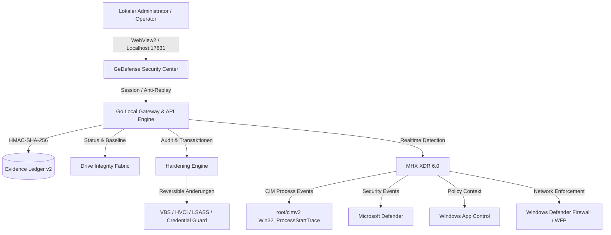

# VGT GeDefense Windows

<div align="center">

### Sovereign Security Fabric for Windows


**LOCAL-FIRST · ZERO CLOUD CONTROL · MHX XDR · DEFENDER · ASR · APP CONTROL · WFP · SYSTEM HARDENING · FILE INTEGRITY · CRYPTOGRAPHIC EVIDENCE**

</div>

---


## 🛡️ Sovereign Windows Security

**VGT GeDefense Windows** ist ein lokales, überprüfbares Windows-Sicherheitszentrum von **VisionGaia Technology**.

GeDefense ersetzt die etablierten Windows-Sicherheitsmechanismen nicht durch unnötige proprietäre Kernel-Hooks, sondern verbindet die von Microsoft vorgesehenen Schutzschichten mit einer eigenen lokalen Detection-, Hardening-, Integrity- und Evidence-Ebene.

Das System orchestriert unter anderem:

| Security Layer                  | Integration                              |
| ------------------------------- | ---------------------------------------- |
| 🧠 **MHX XDR 6.0**              | Realtime Detection & Context Analysis    |
| 🛡️ **Microsoft Defender**      | Endpoint Protection & Antimalware        |
| ⚔️ **Attack Surface Reduction** | Microsoft ASR Rules                      |
| 🔒 **Windows App Control**      | Application Control & Code Integrity     |
| 🔥 **Windows Firewall / WFP**   | Network Enforcement                      |
| 🧬 **Drive Integrity Fabric**   | SHA-256 File Integrity Monitoring        |
| 📊 **SafetySys**                | Windows Security Posture Audit           |
| ⛓️ **Evidence Ledger v2**       | Cryptographic Audit Chain                |
| ⚙️ **Hardening Engine**         | Reversible Windows Security Transactions |

Das Security Center arbeitet ausschließlich über:

```text
127.0.0.1:17831
```

Die Benutzeroberfläche läuft in einem eigenen **WebView2-Fenster**.

**Keine externe Control Plane. Keine Remote-UI. Kein CDN für das Security Center.**

---

## ✨ Highlights

* Live-Security-Dashboard mit Schutzwert, Schutzdomänen und MHX-Telemetrie
* Defender-, Firewall-, Secure-Boot-, TPM-, BitLocker-, VBS- und Update-Posture
* MHX-XDR-Realtimeanalyse für PowerShell, Script Hosts und Windows LOLBins
* automatische Base64-, UTF-16LE- und UTF-8-Analyse von PowerShell `EncodedCommand`
* Payload-, Signatur-, Parent- und Prozesskettenanalyse
* kontextabhängige Klassifikation statt stumpfer Dateinamen-Allowlist
* guarded Prozess-Terminierung nach Risikobewertung
* optionaler **Sovereign Mode** mit Outbound Default-Deny
* Feodo- und Spamhaus-Threat-Intelligence
* atomare Windows-Firewall-Updates
* SafetySys-Auto-Audit mit **31 Windows-Sicherheitsprüfungen**
* zwölf modulare Windows-Härtungskomponenten
* optionaler SHA-256-Integrity-Scanner
* HMAC-SHA-256-verkettete lokale Evidenz
* reversible Security-Transaktionen
* Windows-Dienst, natives Security Center und Systemtray

---

# 🏛️ Architektur



### Vertrauensdomänen

| Komponente                       | Technologie           | Sicherheitsfunktion                                   | Kontext          |
| -------------------------------- | --------------------- | ----------------------------------------------------- | ---------------- |
| **Local Security Center Server** | Go / native x64       | REST-API, Sessions, Replay-Schutz, Asset Serving      | `SYSTEM`         |
| **MHX XDR 6.0**                  | Go + CIM / PowerShell | Realtime-Prozessanalyse, Payload-Decoding, Provenance | `SYSTEM`         |
| **Hardening Engine**             | PowerShell / `Vgt.*`  | Baselines, Hardening, Verification, Rollback          | Admin / `SYSTEM` |
| **Drive Integrity Fabric**       | Go + Win32            | SHA-256 Baselines & FIM                               | `SYSTEM`         |
| **Evidence Ledger v2**           | Go / HMAC-SHA-256     | Manipulationserkennbare lokale Audit-Kette            | `SYSTEM`         |
| **Tray / Launch Broker**         | Go + Win32            | lokaler Bootstrap und Security-Center-Start           | Benutzer / Admin |

---

# 🛡️ Protection Profiles

GeDefense verwendet drei klar getrennte Schutzprofile:

```text
┌─────────────┐       ┌─────────────┐       ┌─────────────────┐
│   MONITOR   │ ────► │   GUARDED   │ ────► │    SOVEREIGN    │
│             │       │             │       │                 │
│ Observe     │       │ Protect     │       │ Default Deny    │
└─────────────┘       └─────────────┘       └─────────────────┘
```

| Schutzfunktion             | `Monitor` |    `Guarded`    |        `Sovereign`        |
| -------------------------- | :-------: | :-------------: | :-----------------------: |
| Realtime-Korrelation       |     ✅     |        ✅        |             ✅             |
| Microsoft Defender         |     ✅     |        ✅        |             ✅             |
| ASR                        |   Audit   |      Block      |           Block           |
| Prozess-Terminierung       |   Audit   | Kontextabhängig | Priorisiertes Enforcement |
| App Control                |   Audit   |      Audit      |          Enforce          |
| Threat-Feed Firewall Rules |  Standard |        ✅        |             ✅             |
| Outbound Default-Deny      |     ❌     |        ❌        |             ✅             |
| Controlled Folder Access   |  optional |     optional    |             ✅             |
| Operator Gate              |   normal  |      normal     |        **explizit**       |

Der Sovereign-Modus erfordert die exakte Operator-Bestätigung:

```text
SOVEREIGN DEFAULT DENY
```

Damit wird verhindert, dass ein aggressives Default-Deny-Profil versehentlich aktiviert wird.

---

# 🧠 MHX XDR 6.0

## Realtime Detection Engine

MHX bildet die verhaltensbasierte Detection- und Kontextschicht von GeDefense.

### Process Telemetry

Neue Prozesse werden ereignisbasiert über Windows CIM erfasst:

```text
root/cimv2
└── Win32_ProcessStartTrace
```

Dadurch benötigt MHX keinen eigenen Kernel-Prozess-Hook.

---

## PowerShell EncodedCommand Analysis

MHX erkennt PowerShell-Aufrufe wie:

```text
-enc
-EncodedCommand
```

und analysiert deren Payload.

Unterstützt werden:

* strikte Base64-Validierung
* UTF-16LE-Decoding
* UTF-8-Decoding
* Payloads bis 1 MiB
* In-Memory-Indikatoren
* Parent-/Child-Lineage
* Authenticode-Kontext
* Publisher-/Subject-Analyse
* LOLBin-Muster
* Script-Host-Kontext

Beispielhafte Indikatoren:

```text
IEX
DownloadString
VirtualAlloc
AmsiUtils
MiniDumpWriteDump
vssadmin delete shadows
```

---

## Contextual Classification

Ein EncodedCommand ist nicht automatisch Malware.

Deshalb analysiert MHX mehrere Ebenen:

```text
PROCESS
   │
   ├── Command Line
   ├── Decoded Payload
   ├── Parent Process
   ├── Process Lineage
   ├── Authenticode
   ├── Publisher
   └── Behavioral Indicators
```

Das erlaubt die Unterscheidung zwischen:

```text
MALICIOUS
SUSPICIOUS
BENIGN SUSPICIOUS
KNOWN GOOD
```

ohne die ursprüngliche Detection abzuschalten.

Auch legitime Entwickler- oder Administrationswerkzeuge mit Encoded PowerShell können dadurch anhand von Signatur, Prozesskette und Payload-Kontext korrekt eingeordnet werden.

---

# 🌐 Threat Intelligence

GeDefense kann Threat-Intelligence-Feeds lokal synchronisieren.

| Feed                       | Zweck                              |
| -------------------------- | ---------------------------------- |
| **abuse.ch Feodo Tracker** | Botnet- und C2-Infrastruktur       |
| **Spamhaus DROP**          | bekannte problematische IPv4-Netze |
| **Spamhaus DROPv6**        | entsprechende IPv6-Netze           |

Standardintervall:

```text
12 Stunden
```

Die Einträge werden lokal normalisiert und dedupliziert.

Firewall-Updates erfolgen atomar, damit ein fehlgeschlagener Sync keinen teilweise aktualisierten Regelsatz hinterlässt.

---

## Aktuelle Grenze in Version 2.3.2

Threat-Intelligence-Adressen werden auf Netzwerkebene blockiert.

Folgende vollständige Realtime-Korrelation ist noch **nicht** Bestandteil von Version 2.3.2:

```text
Remote IP
   ↓
Owning PID
   ↓
Process Tree
   ↓
XDR Context Analysis
   ↓
Automatic Process Tree Response
```

Diese Grenze wird bewusst dokumentiert.

---

# 🔐 Windows Hardening Engine

GeDefense unterstützt modulare und reversible Windows-Härtung.

| Modul                    | Maßnahme                               | Enterprise |
| ------------------------ | -------------------------------------- | :--------: |
| `DefenderCloud`          | Cloud Protection, PUA, MAPS            |      ✅     |
| `ASR`                    | 11 Defender ASR Rules im Block-Modus   |      ✅     |
| `ControlledFolderAccess` | Schutz sensibler Benutzerverzeichnisse |      ✅     |
| `Firewall`               | Profile aktiv, Inbound Block, Logging  |      ✅     |
| `CredentialGuard`        | VBS & Credential Guard                 |      ✅     |
| `MemoryIntegrity`        | HVCI & Vulnerable Driver Blocklist     |      ✅     |
| `LSASS`                  | PPL / WDigest-Härtung                  |      ✅     |
| `SMB`                    | SMBv1 deaktivieren, Signing erzwingen  |      ✅     |
| `PowerShellLogging`      | Script Block & Module Logging          |      ✅     |
| `UAC`                    | hohe UAC-Stufe & Secure Desktop        |      ✅     |
| `USBStorage`             | USB-Massenspeicher deaktivieren        |   Opt-in   |
| `RemoteDesktop`          | eingehendes RDP deaktivieren           |   Opt-in   |

---

## Reversible Security Transactions

Hardening wird nicht als irreversible Einbahnstraße behandelt.

```text
CURRENT STATE
     ↓
BASELINE
     ↓
APPLY
     ↓
VERIFY
     ↓
EVIDENCE
     ↓
ROLLBACK AVAILABLE
```

Vor sicherheitsrelevanten Änderungen wird der relevante Zustand erfasst.

Dadurch können Maßnahmen kontrollierter wieder zurückgenommen werden.

---

# 🧬 Drive Integrity Fabric

Der optionale Integrity Scanner erstellt SHA-256-basierte Baselines lokaler Dateien und Laufwerke.

### Eigenschaften

* Full-Drive SHA-256 Baseline
* `ADDED`
* `MODIFIED`
* `DELETED`
* 256-Bucket-Partitionierung
* Schutz vor Reparse Points
* Schutz vor Junction-Rekursion
* eigenes State-Verzeichnis ausgeschlossen
* 12- oder 24-Stunden-Zyklus
* Full Scan standardmäßig deaktiviert

Beispiel:

```text
GENERATION 18

ADDED       C:\Program Files\Example\new.dll
MODIFIED    C:\Windows\System32\example.dll
DELETED     C:\Program Files\Example\old.dll
```

---

# ⛓️ Evidence Ledger v2

GeDefense führt eine lokale kryptographisch verkettete Evidence-Struktur.

```text
ENTRY N
  │
  ├── sequence
  ├── timestamp
  ├── action
  ├── metadata
  ├── previous_hmac
  └── hmac
        │
        ▼
ENTRY N+1
```

Die Verkettung basiert auf:

```text
HMAC-SHA-256
```

Der lokale Evidence-Key befindet sich unter:

```text
ProgramData\VGT\GeDefense\evidence.key
```

und wird über Windows-ACLs geschützt.

> Eine gültige kryptographische Kette bestätigt die Integrität der gespeicherten Audit-Daten. Sie beweist nicht automatisch die Wahrheit einer externen Datenquelle.

---

# 📊 SafetySys Audit

SafetySys bewertet den lokalen Windows-Sicherheitszustand anhand von **31 Prüfungen**.

Schutzdomänen umfassen unter anderem:

```text
Microsoft Defender
Firewall
Secure Boot
TPM
BitLocker
VBS
HVCI
Credential Guard
ASR
UAC
Windows Update
PowerShell Security
```

Die Ergebnisse fließen in das lokale Security Center ein.

---

# 🖥️ Local Security Center

Das GeDefense Security Center benötigt:

```text
kein IIS
kein Apache
keinen externen Webserver
keine Cloud-Control-Plane
```

## Endpoint

```text
http://127.0.0.1:17831
```

Die API wird ausschließlich an Loopback gebunden.

---

## Session Bootstrap

Beim Start über den Tray bzw. Launch Broker wird ein kurzlebiger kryptographischer Bootstrap-Code erzeugt.

Dieser wird gegen eine lokale Session ausgetauscht.

### Security Properties

```text
HttpOnly
SameSite=Strict
Loopback only
Anti-Replay Request IDs
No CDN
No Remote UI
```

### HTTP Security Headers

```http
Content-Security-Policy: default-src 'self'; script-src 'self'; style-src 'self'; img-src 'self' data:; connect-src 'self'; object-src 'none'; base-uri 'none'; form-action 'self'; frame-ancestors 'none'
X-Frame-Options: DENY
X-Content-Type-Options: nosniff
Referrer-Policy: no-referrer
Cross-Origin-Opener-Policy: same-origin
Cross-Origin-Resource-Policy: same-origin
```

Zustandsändernde Requests verwenden zusätzlich:

```text
X-VGT-Request-ID
```

als Replay-Schutz.

---

# 🧩 Warum kein eigener Kernel-Treiber?

MHX enthält bewusst keinen eigenen proprietären Kernel-Treiber.

Die Prozessaufnahme erfolgt über Windows-CIM.

Kernelnahe Enforcement-Funktionen werden an bestehende Windows-Sicherheitsmechanismen delegiert:

```text
Microsoft Defender
        +
Attack Surface Reduction
        +
Windows App Control
        +
Windows Defender Firewall / WFP
        +
VBS / HVCI
```

Dadurch muss GeDefense keinen zusätzlichen Kernel-Hook einführen, wenn Windows bereits eine geeignete Schutzprimitive bereitstellt.

Das reduziert zusätzliche Kernel-Angriffsfläche und lässt:

```text
Secure Boot
Windows Resource Protection
Windows Update
Microsoft-signierte Systemdateien
```

unangetastet.

---

# ⚙️ Sicherheitsrelevante Defaults

| Einstellung                  | Standard                    |
| ---------------------------- | --------------------------- |
| **Protection Mode**          | `Guarded`                   |
| **Sovereign Default-Deny**   | explizite Operator-Freigabe |
| **Integrity Full Scan**      | deaktiviert                 |
| **USB Storage Block**        | Opt-in                      |
| **Controlled Folder Access** | nicht ungefragt             |
| **API Binding**              | ausschließlich Loopback     |
| **State Changes**            | Session + Replay Protection |
| **Threat Intelligence Sync** | 12 Stunden                  |

---

# 📁 Repository-Struktur

```text
src/GeDefense/windows/   Go-Dienst, Center, Tray, API, MHX und Integrity
audit/                   SafetySys Audit
engine/                  Windows-Härtungsprofile und PowerShell-Module
xdr/                     MHX-, Firewall- und XDR-Transaktionen
installer/               Installation, Bootstrap und Deinstallation
build/                   reproduzierbarer Standalone-Build
branding/                VGT-Markenmaterial
tools/                   erhöhte Integrationsdiagnosen
docs/                    Architektur, Build und Sicherheitsmodell
LICENSES/                AGPL- und Drittanbieterlizenzen
sbom/                    CycloneDX-Komponentenverzeichnis
```

---

# 💻 Voraussetzungen

## Zielplattform

| Parameter             | Minimum                                | Empfohlen                           |
| --------------------- | -------------------------------------- | ----------------------------------- |
| **Windows**           | Windows 10/11 x64                      | Windows 11 IoT Enterprise LTSC 2024 |
| **Build**             | `19041+`                               | `26100.x`                           |
| **Architektur**       | AMD64                                  | AMD64 + TPM 2.0 + Secure Boot       |
| **RAM**               | 4 GB                                   | 8 GB+                               |
| **Hardware Security** | unterstützte Windows Security Features | SLAT für VBS/HVCI                   |
| **PowerShell**        | Windows PowerShell 5.1                 | aktuell gepatcht                    |
| **UI Runtime**        | WebView2                               | aktuelle WebView2 Runtime           |
| **Netzwerk**          | nicht erforderlich                     | optional für Threat Feeds           |

## Entwicklung

* Go `1.23+`
* Windows PowerShell 5.1
* Microsoft WebView2 Runtime
* GNU `windres.exe`
* MinGW-w64 oder kompatible Toolchain
* Administratorrechte für systemweite Integrationstests

---

# 🧪 Entwicklung & Tests

```powershell
Set-Location .\src\GeDefense\windows

gofmt -w .\cmd .\internal
go test -race ./...
go vet ./...
node --check .\internal\server\web\app.js
```

## MHX Integration Test

```powershell
& .\tools\Test-MhxWatcherIntegration.ps1
```

Die erhöhten Integrationstests sind Opt-in.

Weitere Dokumentation:

* [Build-Anleitung](docs/BUILDING.md)
* [Architektur](docs/ARCHITECTURE.md)
* [Threat Model](docs/THREAT-MODEL.md)

---

# 📦 Standalone Installer

```powershell
& .\build\Build-GeDefenseStandalone.ps1
```

Die Build-Pipeline erzeugt die vorgesehenen Artefakte unter:

```text
release\
```

Codesigning-Zertifikate, private Schlüssel und generierte Release-Artefakte gehören **nicht** in das öffentliche Repository.

> **Community Builds sind keine offiziellen VisionGaia Technology Releases.**

---

# 🔏 Packaging & Release Integrity

Die Release-Architektur unterstützt:

* Authenticode
* SHA-256
* signierte Payloads
* Windows-Dateikataloge
* reproduzierbare Standalone-Builds
* CycloneDX SBOM
* optionale WIM-/ISO-Integration

Ein Build ist nur dann ein offizieller VGT-Release, wenn die entsprechende Build- und Signaturkette von VisionGaia Technology kontrolliert wurde.

---

# ↩️ Rollback & Deinstallation

Der Uninstall-Workflow berücksichtigt nicht nur Programmdateien, sondern auch sicherheitsrelevante Konfigurationen:

```text
Windows Service
App Control Policies
Sovereign Firewall Rules
ASR Baseline
Network Baseline
GeDefense State
```

Ziel ist ein kontrollierter Rückbau auf den zuvor dokumentierten Zustand.

---

# ⚠️ Architekturgrenzen von 2.3.2

GeDefense ist ein Security-System — keine Sicherheitsgarantie.

Aktuelle Grenzen:

* kein eigener MHX-Kernel-Treiber
* keine vollständige Remote-IP → PID → Process-Tree Realtime-Korrelation
* externe Threat-Intelligence kann falsch oder veraltet sein
* Full-Drive-Integrity-Scans können hohe I/O-Last erzeugen
* aggressive Hardening-Regeln können legitime Anwendungen beeinträchtigen
* Sovereign Default-Deny kann Netzwerkfunktionen unterbrechen
* manche Schutzfunktionen hängen von Windows Edition, Build und Hardware ab

Diese Einschränkungen werden bewusst dokumentiert statt durch Marketingformulierungen verborgen.

---

# 🔒 Security Principles

```text
LOCAL FIRST
    ↓
OPERATOR AUTHORITY
    ↓
NATIVE WINDOWS SECURITY BOUNDARIES
    ↓
VERIFY BEFORE TRUST
    ↓
EVIDENCE EVERYTHING
    ↓
ROLLBACK WHERE POSSIBLE
```

### Local First

Der zentrale Security-State bleibt lokal.

### Operator Authority

Kritische Schutzänderungen werden nicht still aktiviert.

### Native Security Boundaries

Bestehende Windows-Sicherheitsmechanismen werden bevorzugt.

### Reversible by Design

Der vorherige Zustand wird vor sicherheitsrelevanten Änderungen erfasst.

### Evidence Driven

Sicherheitsentscheidungen und Änderungen sollen nachvollziehbar bleiben.

---

# 🛡️ Sicherheitslücken melden

Bitte **keine unmittelbar ausnutzbaren Schwachstellen als öffentliches Issue veröffentlichen**.

Das koordinierte Disclosure-Verfahren befindet sich unter:

[**SECURITY.md**](SECURITY.md)

Ein guter Security Report enthält nach Möglichkeit:

```text
Version
Komponente
Reproduktionsschritte
Erwartetes Verhalten
Tatsächliches Verhalten
Security Impact
Logs
Proof of Concept
```

Keine Secrets, Zugangsdaten oder unnötigen personenbezogenen Daten veröffentlichen.

---

# 📜 Lizenz

Der Programmcode und die Projekt-Dokumentation stehen unter:

## GNU Affero General Public License v3.0 only

SPDX:

```text
AGPL-3.0-only
```

VGT-, VisionGaia- und GeDefense-Namen, Logos und Produktaufmachungen sind nicht pauschal unter AGPL lizenziert.

Sie unterliegen:

[TRADEMARKS.md](TRADEMARKS.md)

Drittanbieter-Komponenten werden separat dokumentiert:

* [LICENSE-MATRIX.md](LICENSE-MATRIX.md)
* [THIRD-PARTY-NOTICES.md](THIRD-PARTY-NOTICES.md)

---

# 🏢 VisionGaia Technology

**VisionGaia Technology** entwickelt souveräne, lokal kontrollierbare Sicherheits- und Softwaresysteme mit Fokus auf technische Nachvollziehbarkeit, Transparenz und Operator-Kontrolle.

```text
VisionGaia Technology
Cologne, Germany
© 2026
```

---

<div align="center">

### VGT GEDEFENSE WINDOWS 2.3.2

**SOVEREIGN SECURITY FABRIC**

**MHX XDR 6.0 · WINDOWS DEFENDER · ASR · APP CONTROL · WFP · SAFETYSYS · DRIVE INTEGRITY · HMAC-SHA-256 EVIDENCE · LOCAL-FIRST · AGPLv3**

**VisionGaia Technology — Sovereign Security Engineering**

</div>
